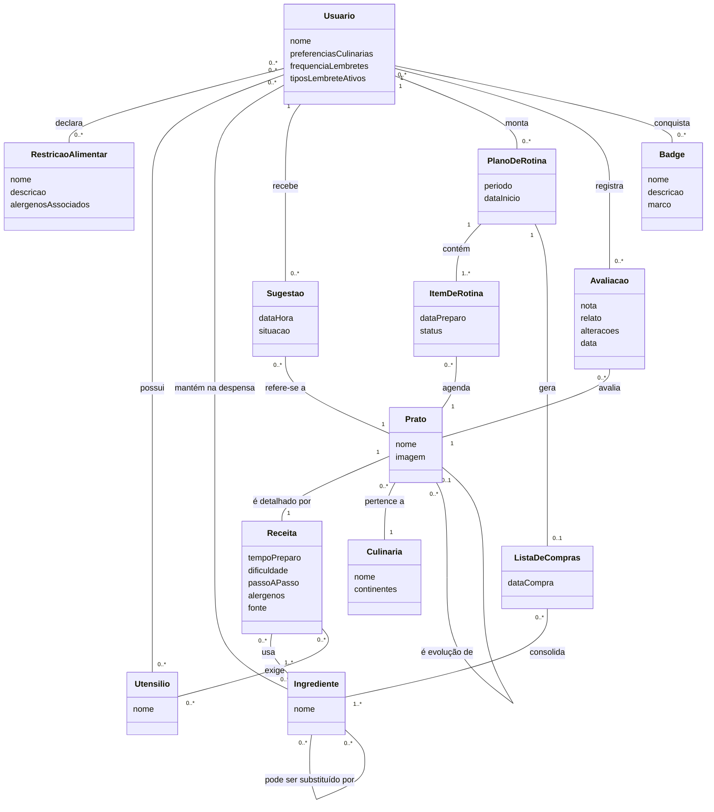

# Modelo Conceitual do Domínio — Panelada

> Fase 1.2 — Análise. Visão estrutural do domínio, independente de tecnologia.
> Destino no repositório: `/docs/fase1/1.2-analise/modelo-conceitual.md`.

---

## 1. Decisão de notação

**Diagrama de classes UML conceitual** (sem métodos, sem tipos de implementação, sem classes técnicas).

Justificativa (critério de desempate do briefing 1.2, decisão D8): o app tem comportamento rico — gamificação com coleção, evolução e badges — que diagramas de classes comunicam melhor; DER puxaria o pensamento para banco de dados (tabelas, chaves). Adicionalmente, o Mermaid `classDiagram` já era o formato canônico obrigatório definido no Guia Geral.

## 2. Escopo do modelo

O modelo cobre apenas funcionalidades **Must e Should** do backlog (decisão D1). Excluídos:

- `Pontuacao` — US13 é Could; regra documentada como RN19 (futura), sem classe no modelo v1.
- `Amizade` / sugestão a amigo — US17 é Could.
- `Ranking` — Won't (ex-RF16); exclusão documentada na RN20.

O briefing 1.2 pedia 8–12 classes; o modelo tem **13**, com justificativa registrada (decisão D3): cada classe é exigida por ao menos uma US Must/Should, e qualquer corte adicional violaria a rastreabilidade.

## 3. Diagrama (Mermaid v1.1 — fonte da verdade)

Convenções do diagrama: atributos sem tipos e sem parênteses (nível conceitual); associações sem setas de navegabilidade; atributos de associação (`dataDesbloqueio`, `comprado`) registrados em comentários, pois o Mermaid não os representa graficamente. PNG/SVG exportados pelo mermaid.live ficam fora do repositório-fonte, apenas para o slide.

## 4. Classes conceituais

| Classe | Descrição | Atributos conceituais | Associações |
|---|---|---|---|
| Usuario | Pessoa que descobre pratos, planeja a rotina e registra preparos | nome; preferências culinárias; frequência de lembretes; tipos de lembrete ativos | declara 0..* RestricaoAlimentar; possui 0..* Utensilio; mantém 0..* Ingrediente (despensa); recebe 0..* Sugestao; monta 0..* PlanoDeRotina; registra 0..* Avaliacao; conquista 0..* Badge |
| RestricaoAlimentar | Condição declarada no perfil que filtra sugestões; dado sensível (LGPD, RNF06) | nome; descrição; alérgenos associados | declarada por 0..* Usuario |
| Utensilio | Equipamento de cozinha (ex.: fogão, forno) | nome | possuído por 0..* Usuario; exigido por 0..* Receita |
| Ingrediente | Item que compõe receitas, despensa e lista de compras | nome | usado em 0..* Receita; mantido por 0..* Usuario; consolidado em 0..* ListaDeCompras; pode substituir 0..* Ingrediente |
| Culinaria | País ou região que agrupa pratos (ex.: japonesa, nordestina) | nome; continentes (multivalorado: América, África, Europa, Ásia, Oceania) | agrupa 0..* Prato |
| Prato | Unidade da coleção e das cadeias de evolução | nome; imagem | pertence a 1 Culinaria; detalhado por 1 Receita; é evolução de 0..1 Prato; tem 0..* evoluções; referenciado por 0..* Sugestao; agendado em 0..* ItemDeRotina; avaliado em 0..* Avaliacao |
| Receita | Instruções de preparo de um prato | tempo de preparo; dificuldade {fácil, média, difícil}; passo a passo numerado; alérgenos; fonte (RNF08) | detalha 1 Prato; usa 1..* Ingrediente; exige 0..* Utensilio |
| Sugestao | Recomendação de prato apresentada ao usuário, com ciclo de vida | data/hora; situação {apresentada, candidata, descartada} | recebida por 1 Usuario; refere-se a 1 Prato |
| PlanoDeRotina | Conjunto de pratos candidatos com datas, em um período | período {semana, quinzena}; data de início | montado por 1 Usuario; contém 1..* ItemDeRotina; gera 0..1 ListaDeCompras |
| ItemDeRotina | Prato agendado em uma data dentro do plano | data de preparo; status {planejado, em preparo, concluído} | pertence a 1 PlanoDeRotina; agenda 1 Prato |
| ListaDeCompras | Ingredientes consolidados do plano, sem duplicatas e sem quantidades (v1) | data de compra | gerada por 1 PlanoDeRotina; consolida 1..* Ingrediente (marcação "comprado" na associação) |
| Avaliacao | Registro de um preparo concluído | nota (obrigatória, 0 a 5 em passos de 0,5 — RN05); relato (opcional); alterações (opcional); data | registrada por 1 Usuario; avalia 1 Prato |
| Badge | Conquista concedida ao atingir um marco verificável (RN03) | nome; descrição; marco (critério verificável) | conquistado por 0..* Usuario (data de desbloqueio na associação) |

## 5. Autoassociações e atributos de associação

- `Prato "0..*" -- "0..1" Prato : é evolução de` — cada evolução tem no máximo um prato base (D4); um prato base pode ter várias evoluções; profundidade da cadeia é livre (evolução de evolução).
- `Ingrediente "0..*" -- "0..*" Ingrediente : pode ser substituído por` — substituição global e dirigida (D5): "leite pode ser substituído por leite de aveia" não implica o caminho inverso.
- `Usuario–Badge` carrega `dataDesbloqueio`; `ListaDeCompras–Ingrediente` carrega `comprado`. Se for preciso explicitá-los graficamente no futuro, promover a classes-associação (Conquista, ItemDeCompra).

## 6. Conceitos derivados (deliberadamente fora do diagrama)

| Conceito | Derivação |
|---|---|
| Coleção | Conjunto de pratos distintos concluídos pelo usuário (RN01), agrupados por culinária (RN07) |
| Histórico | Conjunto de avaliações do usuário, cada uma um preparo distinto (RN06) |
| Catálogo | Conjunto de todos os pratos/receitas mantidos pelo curador |
| Lembrete | Evento disparado nas datas de compra e de preparo, configurável em frequência e tipos (atributos de Usuario); RN13 — decisão D2 |
| Candidata | Estado de Sugestao ("aprovada"), não classe separada |
| Sessão | Conceito de execução; regra de descarte coberta pela RN11 — decisão D11e |

## 7. Divergências e desvios registrados

1. **Briefing 1.2 × artefatos da 1.1:** a lista-semente do briefing previa `Pontuacao`, `Amizade` e `Ranking` no modelo e RNs ativas de pontuação e ranking. A 1.1 fechou ranking como Won't e pontuação/social como Could. Prevaleceram os artefatos aprovados da 1.1 (convenção de divergências do Guia Geral); pontuação virou RN futura (RN19) e ranking virou nota de exclusão (RN20).
2. **Avaliacao → Prato, não Receita (D11a):** o exemplo de formato do briefing ligava Avaliacao a Receita; o léxico define avaliação como registro de preparo, e coleção, evolução e badges operam sobre pratos. A ligação com Receita existe via Prato 1–1.
3. **Refinamentos durante a escrita das RNs (D12):** `Culinaria.continentes` (multivalorado — culinárias de região cruzam continentes, ex.: árabe → {Ásia, África}) e `RestricaoAlimentar.alergenosAssociados` foram adicionados para tornar RN03 e RN08 testáveis.

## 8. Rastreabilidade (verificação bidirecional)

Toda classe aparece em ao menos um UC; todo UC referencia classes do modelo; toda US Must tem UC.

| Classe | Casos de uso |
|---|---|
| Usuario | UC01–UC11, UC13 |
| RestricaoAlimentar | UC01, UC04, UC08, UC09 |
| Utensilio | UC04, UC12 |
| Ingrediente | UC03, UC04, UC06, UC09, UC12 |
| Culinaria | UC11, UC12 |
| Prato | UC01–UC05, UC10–UC13 |
| Receita | UC03, UC04, UC08, UC09, UC12 |
| Sugestao | UC01, UC02, UC03, UC05 |
| PlanoDeRotina | UC05, UC06, UC07 |
| ItemDeRotina | UC05, UC07, UC10 |
| ListaDeCompras | UC06, UC07 |
| Avaliacao | UC01, UC10, UC13 |
| Badge | UC10 |

US → UC: US01→UC01, US02→UC02, US03→UC03, US05→UC04, US06→UC05, US07→UC06, US08→UC07, US09→UC08, US10→UC09, US12→UC10, US14→UC11, US18→UC12; US15 (Should)→UC13 (registro opcional).
