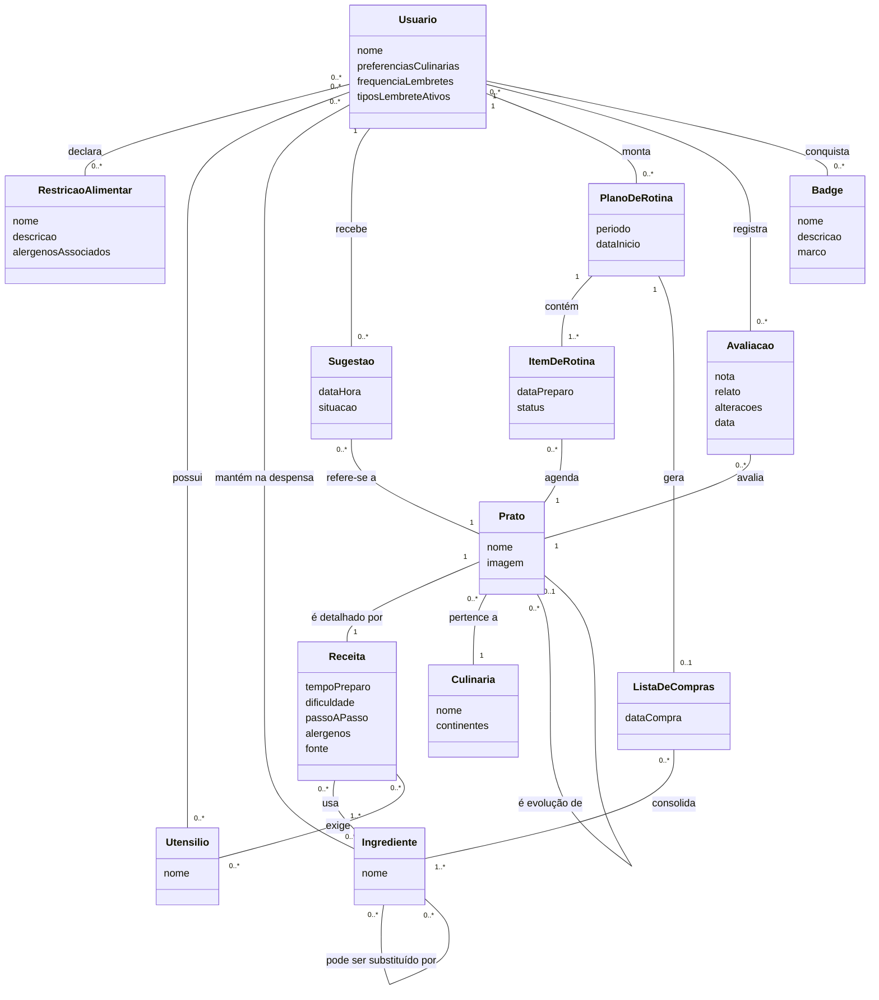

# Documento de Requisitos — Panelada (v1.0)

> **Fase 1.3 — Documentação.** Este documento consolida, em texto único, os artefatos produzidos na elicitação (1.1) e na análise (1.2), **sem alteração de conteúdo** — cada seção aponta para o arquivo modular correspondente, que é a fonte de verdade.
> Identificadores estáveis (Guia Geral, seção 6): `RF##`, `RNF##`, `US##`, `UC##`, `RN##` — nunca renumerados.
> Consolidado em 09/09/2026.

## Sumário

1. [Visão do produto](#1-visão-do-produto)
2. [Personas](#2-personas)
3. [Léxico](#3-léxico)
4. [Requisitos funcionais e não funcionais](#4-requisitos-funcionais-e-não-funcionais)
5. [Backlog priorizado (MoSCoW)](#5-backlog-priorizado-moscow)
6. [Modelo conceitual](#6-modelo-conceitual)
7. [Casos de uso](#7-casos-de-uso)
8. [Regras de negócio](#8-regras-de-negócio)
9. [Rastreabilidade](#9-rastreabilidade)

---

## 1. Visão do produto

**Elevator pitch:** Para pessoas que gostam de cozinhar e querem escapar da rotina de repetir sempre os mesmos pratos, o Panelada é um aplicativo mobile de culinária internacional que transforma o ato de cozinhar em uma experiência divertida e recompensadora. Diferente dos apps de receitas tradicionais, ele estimula o usuário a aprender pratos novos continuamente, combinando o planejamento da rotina de cozinha com mecânicas de jogo que celebram cada receita concluída como uma conquista.

**Declaração de visão:** Ser a principal referência em culinária internacional para cozinheiros amadores que buscam variedade e diversão na cozinha. O Panelada busca tornar o processo de cozinhar mais divertido e estimular o aprendizado de pratos novos: o usuário descobre receitas de diferentes países conforme seu perfil, organiza sua rotina de refeições (escolha do prato, data de compra dos ingredientes e data de preparo), registra avaliações e adaptações pessoais, e compartilha a experiência com amigos — com catálogo inicial alimentado por plataformas públicas de receitas.

**Conceito de gamificação:** abordagem híbrida com três camadas — coleção/exploração como espinha dorsal ("Pokédex de pratos"), maestria via cadeias de evolução (prato base → versões mais complexas) e desafio social leve como consequência (sugestões entre amigos). Interação social aprofundada despriorizada nesta versão.

**Stakeholders:**
- **Do produto (geram requisitos):** cozinheiro/jogador (usuário principal; interesse secundário documentado: interação com amigos — se o social subir de prioridade, "amigo" volta a ser stakeholder separado); curador/admin de receitas.
- **Do projeto (influem o processo):** dupla de desenvolvimento; professor (avaliador).
- **Externo/restrição:** plataformas públicas de receitas (origem do conteúdo; exigem atribuição).

Fonte modular: [requisitos.md](../1.1-elicitacao/requisitos.md)

---

## 2. Personas

A elicitação foi 100% simulada com IA (permitido pela disciplina): três personas responderam a um roteiro de 11 perguntas, e os dois desenvolvedores responderam ao mesmo roteiro — cinco entrevistas no total.

| Persona | Perfil em uma linha | O que espera do Panelada |
|---|---|---|
| **Marina Duarte** — a planejadora indecisa | 27 anos, analista de marketing em home office; cozinha 4–5x/semana, mas caiu na rotina de ~10 pratos repetidos | Decidir rápido o cardápio da semana/quinzena e organizar a compra dos ingredientes com calma, por data |
| **Rafael Lima** — o colecionador impulsivo | 22 anos, estudante universitário e gamer; cozinha por impulso 1–2x/semana | Abrir o app e em poucos minutos escolher algo para cozinhar agora com o que tem em casa; completar a coleção, evoluir pratos, pontuar |
| **Cleusa Souza** — a cozinheira experiente com restrições | 45 anos, professora; cozinha todo dia para a família; marido diabético; mora no interior, onde ingredientes internacionais são difíceis de achar | Pratos compatíveis com as restrições da família e com os ingredientes da região; caderno digital de avaliações e substituições |

Cobertura: indecisão na escolha (Marina), cozinhar na hora (Rafael), pratos acessíveis/restrições e avaliações (Cleusa), planejamento de semana/quinzena (Marina). Cada RF registra sua origem nas personas (M, R, C), nos desenvolvedores (D1, D2) ou no benchmarking (BM).

Fonte modular: [personas.md](../1.1-elicitacao/personas.md)

---

## 3. Léxico

O léxico do domínio define 25 termos — de **Prato**, **Receita** e **Culinária** até **Cadeia de evolução**, **Despensa**, **Candidata** e **Badge** — incluindo o registro explícito de **Ranking** como termo descartado (Won't) nesta versão.

Fonte modular: [lexico.md](../1.1-elicitacao/lexico.md)

---

## 4. Requisitos funcionais e não funcionais

18 RF ativos (RF16 descartado e preservado para rastreabilidade — IDs nunca são renumerados) e 10 RNF.

### Requisitos funcionais

| ID | Requisito | Origem |
|---|---|---|
| RF01 | O sistema deve sugerir pratos com base no perfil do usuário (preferências, restrições e histórico de preparos) | M, D1, D2 |
| RF02 | O sistema deve permitir aprovar ou descartar rapidamente cada prato sugerido | D2, M |
| RF03 | O sistema deve permitir registrar os ingredientes disponíveis em casa e sugerir pratos compatíveis, indicando os ingredientes faltantes | M, R, D1 |
| RF04 | O sistema deve permitir planejar refeições da semana ou quinzena, associando cada prato a uma data de preparo | M, C |
| RF05 | O sistema deve gerar uma lista de compras consolidada a partir dos pratos planejados, com data de compra | M, D1, BM-SideChef |
| RF06 | O sistema deve enviar lembretes nas datas de compra e de preparo definidas pelo usuário | D2, C, BM-Duolingo |
| RF07 | O sistema deve permitir cadastrar restrições alimentares no perfil, filtrar automaticamente as sugestões e alertar sobre alérgenos presentes em uma receita | C, D2, BM-Yummly |
| RF08 | O sistema deve sugerir substituições para ingredientes marcados como indisponíveis ou restritos ao usuário | D1, R, C |
| RF09 | O sistema deve permitir buscar receitas por nome, país/culinária, ingrediente ou tempo de preparo | Escopo |
| RF10 | O sistema deve exibir cada receita com imagem, tempo de preparo, nível de dificuldade, ingredientes e passo a passo | BM-Tasty, M, R |
| RF11 | O sistema deve permitir registrar avaliação pessoal de cada prato concluído (nota, relato e alterações feitas), mantendo o histórico de preparos do usuário | D1, D2, C, M |
| RF12 | O sistema deve atribuir pontos por prato concluído, calculados a partir da dificuldade da receita e do ineditismo para o usuário | Escopo, R |
| RF13 | O sistema deve manter a coleção pessoal de pratos do usuário, exibindo o progresso por país/culinária | R, M, decisão de gamificação |
| RF14 | O sistema deve organizar pratos em cadeias de evolução, em que uma versão base desbloqueia versões mais complexas | Decisão de gamificação, todos |
| RF15 | O sistema deve conceder badges ao atingir marcos definidos (ex.: pratos de N países distintos) | Escopo, C, R |
| ~~RF16~~ | ~~O sistema deve exibir um ranking de pontos entre o usuário e seus amigos~~ — **DESCARTADO (Won't):** apenas 1 dos 5 entrevistados demonstrou interesse; social despriorizado pela dupla | Escopo, R |
| RF17 | O sistema deve permitir sugerir um prato a um amigo | Escopo, D1, C, R |
| RF18 | O sistema deve permitir ao curador importar e manter o catálogo de receitas, incluindo dificuldade, alérgenos e cadeias de evolução | Decisão de fonte de conteúdo |
| RF19 | O sistema deve informar os utensílios necessários em cada receita e sinalizar, nas sugestões, os pratos inviáveis pelos utensílios que o usuário declarou possuir | D1, R |

### Requisitos não funcionais

| ID | Requisito | Origem |
|---|---|---|
| RNF01 | O sistema deve ser um aplicativo mobile | Decisão da dupla |
| RNF02 | O sistema deve levar o usuário do primeiro acesso à primeira sugestão de prato em até 2 minutos, sem cadastro extenso | D1, D2, M, C, BM-Yummly (anti-req.) |
| RNF03 | O sistema deve responder a uma solicitação de sugestão de pratos em até 2,5 segundos | Derivado (decisão rápida, D2) |
| RNF04 | O sistema deve permitir iniciar qualquer fluxo principal (sugestões, planejamento, registro de avaliação) em até 2 toques a partir da tela inicial | C, D1, D2 |
| RNF05 | O sistema deve permitir consultar offline as receitas já planejadas ou em preparo | C (cozinha/bancada) |
| RNF06 | O sistema deve tratar dados de restrições alimentares como dados sensíveis, com consentimento explícito, conforme a LGPD | C, D2 |
| RNF07 | O sistema deve permitir configurar frequência e tipos de notificação, sem envio excessivo | D2, BM-Duolingo (anti-req.) |
| RNF08 | O sistema deve exibir a atribuição da fonte pública de cada receita importada | Stakeholder externo |
| RNF09 | O sistema não deve punir o usuário por inatividade (sem perda de pontos, sequências ou progresso) | BM-Duolingo (anti-req.) |
| RNF10 | O registro de avaliação deve ter apenas a nota como campo obrigatório; relato e alterações são opcionais | R, walkthrough da dupla |

### Anti-requisitos (benchmarking dirigido)

- Sem cadastro longo antes do primeiro uso (Yummly como contraexemplo).
- Sem conteúdo gerado por usuários na v1 (Cookpad como contraexemplo; catálogo curado).
- Sem punição por inatividade ou pressão excessiva por notificações (Duolingo como contraexemplo parcial).
- Sem integração de e-commerce de supermercado (SideChef como contraexemplo de escopo).
- Ranking nunca como elemento central — descartado nesta versão.

Fonte modular: [requisitos.md](../1.1-elicitacao/requisitos.md)

---

## 5. Backlog priorizado (MoSCoW)

18 histórias (US01–US18), com rastreabilidade US → RF e priorização MoSCoW final aprovada pela dupla.

| Prioridade | Histórias |
|---|---|
| **Must** (12) | US01, US02, US03, US05, US06, US07, US08, US09, US10, US12, US14, US18 |
| **Should** (4) | US15 *(primeiro)*, US04, US11, US16 |
| **Could** (2) | US13, US17 |
| **Won't** (1) | Ranking entre amigos (ex-RF16): apenas 1 dos 5 entrevistados tinha interesse; social exige implementação cuidadosa; dupla optou por foco |

Decisões de priorização: a identidade de gamificação é coleção (Must) → evolução (primeiro Should) → badges (Should); pontuação (US13) é Could por ser mecânica "batida". US08 (lembretes) é Must por fundamentação em computação persuasiva, desde que não irritante (RNF07).

### Must

#### US01 — Receber sugestões de pratos alinhadas ao perfil (Must · RF01)
Como Marina, quero receber sugestões de pratos alinhadas ao meu perfil, para decidir rápido o que cozinhar sem cair na rolagem infinita.
- Dado que meu perfil tem preferências e restrições cadastradas, quando abro as sugestões, então vejo apenas pratos compatíveis com elas.
- Dado que já preparei um prato, quando recebo sugestões, então ele não é apresentado como novidade.

#### US02 — Aprovar ou descartar sugestões com um toque (Must · RF02)
Como Marina, quero aprovar ou descartar cada sugestão com um toque, para montar minha lista de candidatos sem fricção.
- Dado que estou vendo uma sugestão, quando a descarto, então a próxima sugestão aparece e a descartada não retorna naquela sessão.
- Dado que aprovei uma sugestão, quando a aprovo, então ela fica marcada como "escolhida" e disponível para o planejamento.

#### US03 — Informar os ingredientes disponíveis em casa (Must · RF03)
Como Rafael, quero informar os ingredientes que tenho em casa, para descobrir o que dá para cozinhar na hora.
- Dado que registrei meus ingredientes disponíveis, quando peço sugestões, então vejo pratos que usam esses ingredientes.
- Dado que um prato sugerido exige ingredientes faltantes, quando o visualizo, então os faltantes aparecem claramente destacados.

#### US05 — Visualizar receita completa com passo a passo (Must · RF10)
Como Cleusa, quero ver a receita com foto, tempo, dificuldade, ingredientes e passo a passo, para avaliar se consigo prepará-la.
- Dado que abro uma receita, quando a tela carrega, então vejo imagem, tempo de preparo, nível de dificuldade, lista de ingredientes e passo a passo numerado.
- Dado que estou no passo a passo, quando avanço um passo, então o passo atual fica destacado.

#### US06 — Montar plano de refeições da semana ou quinzena (Must · RF04)
Como Marina, quero montar o plano de refeições da semana ou da quinzena associando cada prato a uma data de preparo, para organizar minha rotina.
- Dado que tenho pratos marcados como "escolhidos", quando monto o plano, então consigo associar cada prato a uma data de preparo.
- Dado que escolhi o período (semana ou quinzena), quando visualizo o plano, então vejo os pratos organizados por data.
- Dado que um prato já tem data, quando o reagendo, então a nova data substitui a anterior.

#### US07 — Gerar lista de compras consolidada do plano (Must · RF05)
Como Marina, quero que o app gere a lista de compras consolidada do meu plano, com data de compra, para comprar os ingredientes com calma.
- Dado que meu plano tem pratos com datas, quando gero a lista de compras, então ela consolida os ingredientes de todos os pratos, sem itens duplicados.
- Dado que a lista foi gerada, quando a visualizo, então consigo definir a data de compra e marcar cada item como comprado.

#### US08 — Receber lembretes de compra e preparo (Must · RF06)
Como Cleusa, quero receber lembretes nas datas de compra e de preparo, para não esquecer o que planejei.
- Dado que defini uma data de compra, quando ela chega, então recebo uma notificação com a lista de compras.
- Dado que defini uma data de preparo, quando ela se aproxima, então recebo um lembrete indicando o prato do dia.
- Dado que desativei os lembretes nas configurações, quando uma data chega, então nenhuma notificação é enviada.

#### US09 — Cadastrar restrições alimentares e receber alertas (Must · RF07)
Como Cleusa, quero cadastrar as restrições alimentares da família no perfil e ser alertada sobre alérgenos, para cozinhar com segurança.
- Dado que cadastrei uma restrição (ex.: diabetes), quando recebo sugestões, então pratos incompatíveis são filtrados ou claramente sinalizados.
- Dado que uma receita contém um alérgeno comum (ex.: glúten, lactose, amendoim), quando a visualizo, então o alerta de alérgeno é exibido.

#### US10 — Ver substituições sugeridas para ingredientes (Must · RF08)
Como Cleusa, quero ver substituições sugeridas para ingredientes que não tenho ou não posso consumir, para adaptar receitas sem desistir delas.
- Dado que um ingrediente da receita está marcado como indisponível ou restrito no meu perfil, quando visualizo a receita, então vejo ao menos uma substituição sugerida para ele.
- Dado que não há substituto cadastrado, quando visualizo o ingrediente, então o sistema informa isso explicitamente, em vez de inventar uma troca.

#### US12 — Registrar avaliação de prato concluído com histórico (Must · RF11)
Como Cleusa, quero registrar nota, relato e alterações de cada prato que fiz, mantendo meu histórico, para ter meu caderno digital de receitas.
- Dado que concluí um prato, quando registro a avaliação, então apenas a nota é obrigatória; relato e alterações são opcionais (RNF10).
- Dado que tenho avaliações, quando acesso o histórico, então vejo cada preparo com data, nota e alterações.
- Dado que repeti um prato, quando o registro novamente, então o histórico guarda os dois preparos separadamente.

#### US14 — Ver coleção de pratos por país/culinária com progresso (Must · RF13)
Como Rafael, quero ver minha coleção de pratos por país/culinária com o progresso, para saber o que falta completar.
- Dado que concluí pratos, quando abro a coleção, então os vejo agrupados por culinária com o percentual de progresso de cada uma.
- Dado que uma culinária está incompleta, quando a visualizo, então vejo quantos pratos faltam.

#### US18 — Importar e manter catálogo de receitas (Must · RF18)
Como curador de conteúdo, quero importar e manter o catálogo de receitas com todos os atributos, para que o app tenha conteúdo confiável.
- Dado que importo uma receita de plataforma pública, quando a cadastro, então registro fonte, ingredientes, utensílios, dificuldade, tempo e alérgenos (RNF08).
- Dado que uma receita faz parte de uma cadeia, quando a cadastro, então indico qual é o prato base.

### Should

#### US15 — Desbloquear evoluções de pratos ao concluir a versão base (Should — primeiro dos Should · RF14)
Como Rafael, quero desbloquear versões mais complexas de um prato ao concluir a versão base, para ter um caminho de evolução.
- Dado que concluí o prato base de uma cadeia (ex.: cuscuz), quando o registro é salvo, então a evolução (ex.: cuscuz recheado) é desbloqueada.
- Dado que uma evolução está bloqueada, quando a visualizo, então vejo qual prato base preciso concluir.

#### US04 — Buscar receitas por nome, país, ingrediente ou tempo (Should · RF09)
Como Cleusa, quero buscar receitas por nome, país, ingrediente ou tempo de preparo, para encontrar rápido o que cabe na minha rotina.
- Dado que estou na busca, quando filtro por "até 30 minutos", então só vejo receitas com tempo de preparo de até 30 minutos.
- Dado que busco por uma culinária, quando confirmo, então vejo apenas receitas dessa culinária.

#### US11 — Ver utensílios exigidos e filtrar por utensílios disponíveis (Should · RF19)
Como Rafael, quero ver os utensílios que cada receita exige e que as sugestões respeitem o que tenho na cozinha, para não começar um prato que não consigo terminar.
- Dado que cadastrei meus utensílios (ex.: fogão e micro-ondas, sem forno), quando recebo sugestões, então pratos que exigem utensílios ausentes vêm sinalizados ou são filtrados.
- Dado que abro uma receita, quando vejo os detalhes, então a lista de utensílios aparece junto da lista de ingredientes.
- Dado que um prato exige utensílio que não tenho, quando o visualizo, então o sistema indica qual utensílio falta antes do preparo.

#### US16 — Receber badges ao atingir marcos (Should · RF15)
Como Cleusa, quero receber badges ao atingir marcos, para ter orgulho da minha trajetória na cozinha.
- Dado que concluí pratos de 10 países distintos, quando o décimo é registrado, então recebo o badge correspondente.
- Dado que abro meu perfil, quando vejo os badges, então vejo os conquistados e os critérios dos ainda não obtidos.

### Could

#### US13 — Ganhar pontos por prato concluído (Could · RF12)
Como Rafael, quero ganhar pontos por prato concluído conforme dificuldade e ineditismo, para sentir progresso real.
- Dado que concluí e avaliei um prato, quando o registro é salvo, então recebo pontos calculados a partir da dificuldade da receita.
- Dado que o prato é inédito para mim, quando concluo, então recebo um bônus de ineditismo; se for repetição, o bônus não se aplica.
- Dado que recebi pontos, quando consulto meu saldo, então vejo a origem de cada pontuação.

#### US17 — Sugerir prato a um amigo (Could · RF17)
Como Cleusa, quero sugerir um prato a um amigo, para trocar experiências como faço com minhas irmãs.
- Dado que estou vendo um prato, quando escolho sugerir a um amigo, então ele recebe a sugestão.
- Dado que recebi uma sugestão, quando a abro, então posso aceitá-la (vira candidata) ou recusá-la.

### Won't

- **Ranking entre amigos (ex-RF16):** descartado nesta versão. Justificativa: apenas Rafael (1 dos 5 entrevistados) demonstrou interesse; a dupla despriorizou o social por exigir implementação cuidadosa. Candidato a revisão em versões futuras, junto com a possível resseparação do stakeholder "amigo do usuário".

Fonte modular: [backlog.md](../1.1-elicitacao/backlog.md)

---

## 6. Modelo conceitual

**Notação:** diagrama de classes UML conceitual (sem métodos, sem tipos de implementação), em Mermaid como fonte da verdade. **Escopo:** apenas funcionalidades Must e Should — `Pontuacao` (US13, Could), `Amizade` (US17, Could) e `Ranking` (Won't) ficaram fora do modelo v1. O briefing 1.2 pedia 8–12 classes; o modelo tem **13**, com justificativa registrada (decisão D3): cada classe é exigida por ao menos uma US Must/Should.

### Classes conceituais (resumo)

| Classe | Descrição | Atributos conceituais |
|---|---|---|
| Usuario | Pessoa que descobre pratos, planeja a rotina e registra preparos | nome; preferências culinárias; frequência de lembretes; tipos de lembrete ativos |
| RestricaoAlimentar | Condição declarada no perfil que filtra sugestões; dado sensível (LGPD, RNF06) | nome; descrição; alérgenos associados |
| Utensilio | Equipamento de cozinha (ex.: fogão, forno) | nome |
| Ingrediente | Item que compõe receitas, despensa e lista de compras | nome |
| Culinaria | País ou região que agrupa pratos (ex.: japonesa, nordestina) | nome; continentes (multivalorado) |
| Prato | Unidade da coleção e das cadeias de evolução | nome; imagem |
| Receita | Instruções de preparo de um prato | tempo de preparo; dificuldade {fácil, média, difícil}; passo a passo numerado; alérgenos; fonte (RNF08) |
| Sugestao | Recomendação de prato apresentada ao usuário, com ciclo de vida | data/hora; situação {apresentada, candidata, descartada} |
| PlanoDeRotina | Conjunto de pratos candidatos com datas, em um período | período {semana, quinzena}; data de início |
| ItemDeRotina | Prato agendado em uma data dentro do plano | data de preparo; status {planejado, em preparo, concluído} |
| ListaDeCompras | Ingredientes consolidados do plano, sem duplicatas e sem quantidades (v1) | data de compra |
| Avaliacao | Registro de um preparo concluído | nota (obrigatória, 0 a 5 em passos de 0,5 — RN05); relato (opcional); alterações (opcional); data |
| Badge | Conquista concedida ao atingir um marco verificável (RN03) | nome; descrição; marco |

Destaques de modelagem: autoassociações `Prato → Prato` (cadeia de evolução, cada evolução com no máximo um prato base) e `Ingrediente → Ingrediente` (substituição global e dirigida); atributos de associação `dataDesbloqueio` (Usuario–Badge) e `comprado` (ListaDeCompras–Ingrediente) registrados em comentários no diagrama. Conceitos derivados (Coleção, Histórico, Catálogo, Lembrete, Candidata, Sessão) ficam deliberadamente fora do diagrama.

Fonte modular (tabela completa com associações, divergências e verificação bidirecional): [modelo-conceitual.md](../1.2-analise/modelo-conceitual.md)

---

## 7. Casos de uso

Um UC para cada US Must (12), mais UC13 para US15 (Should, registro opcional aprovado). US04, US11 e US16 (Should) não têm UC especificado nesta versão; seus comportamentos aparecem como fluxos alternativos e RNs referenciados.

**Atores:**
- **Usuario** — cozinheiro/jogador (personas Marina, Rafael, Cleusa): descobre, planeja, prepara e registra pratos.
- **Curador** — importa e mantém o catálogo de receitas (fonte, dificuldade, alérgenos, cadeias de evolução).
- **Tempo** — ator secundário: dispara os lembretes nas datas de compra e de preparo (UC07).

| UC | Nome | Ator | Origem | Fluxo principal (resumo) |
|---|---|---|---|---|
| UC01 | Receber sugestões alinhadas ao perfil | Usuario | US01 | Sistema seleciona pratos do catálogo compatíveis com preferências e restrições (RN08, RN10), exclui pratos já concluídos (RN01) e apresenta uma sugestão por vez; primeiro acesso respeita o limite de 2 minutos (RNF02) |
| UC02 | Aprovar ou descartar sugestão | Usuario | US02 | Aprovar torna a sugestão "candidata" (disponível ao planejamento); descartar impede seu retorno na sessão (RN11); próxima sugestão é apresentada |
| UC03 | Cozinhar na hora com a despensa | Usuario | US03 | Usuario registra os ingredientes disponíveis; sistema sugere pratos compatíveis e destaca os ingredientes faltantes (RN10) |
| UC04 | Visualizar receita | Usuario | US05 | Exibe imagem, tempo, dificuldade, ingredientes, utensílios e fonte (RN17); passo a passo numerado com destaque do passo atual; alertas de alérgeno e incompatibilidade (RN08, RN16) |
| UC05 | Montar plano de refeições | Usuario | US06 | Novo plano (semana ou quinzena); cada prato candidato é associado a uma data de preparo (item "planejado" — RN12); reagendamento substitui a data; data vencida sem avaliação não gera punição (RNF09) |
| UC06 | Gerar lista de compras consolidada | Usuario | US07 | Consolida os ingredientes do plano sem duplicatas e sem quantidades (RN14); usuário define a data de compra e marca itens como comprados; regeneração preserva marcações |
| UC07 | Receber lembretes de compra e preparo | Usuario (+ Tempo) | US08 | Na data de compra, notificação com a lista; na data de preparo, lembrete com o prato do dia; frequência e tipos configuráveis; desativados, nada é enviado (RN13) |
| UC08 | Cadastrar restrições alimentares | Usuario | US09 | Cadastro com consentimento explícito (dado sensível, RN09); a restrição passa a filtrar sugestões (RN08); alerta de incompatibilidade na visualização (RN16); revogável a qualquer momento |
| UC09 | Consultar substituições de ingredientes | Usuario | US10 | Ingredientes faltantes ou incompatíveis são marcados; para cada um, o sistema exibe os substitutos globais cadastrados; sem substituto, informa explicitamente (RN15) |
| UC10 | Registrar avaliação de prato | Usuario | US12 | Nota obrigatória (0 a 5 em passos de 0,5 — RN05), relato e alterações opcionais; ao salvar, o prato passa a constar como concluído (RN01), o preparo entra no histórico (RN06) e o sistema verifica desbloqueios de evoluções (RN02) e badges (RN03, RN04) |
| UC11 | Consultar coleção por culinária | Usuario | US14 | Pratos concluídos (RN01) agrupados por culinária, com percentual de progresso e quantidade faltante (RN07) |
| UC12 | Importar e manter catálogo de receitas | Curador | US18 | Curador importa receita de plataforma pública, cadastra prato e receita com todos os atributos (fonte obrigatória — RN17, RNF08) e indica exatamente um prato base se for evolução (RN18) |
| UC13 | Desbloquear evolução de prato | Usuario | US15 (Should) | Ao salvar a avaliação do prato base, o sistema desbloqueia as evoluções diretas (RN02, RN18); cadeias podem ter profundidade maior que dois níveis |

Fonte modular (fluxos alternativos e de exceção completos): [casos-de-uso.md](../1.2-analise/casos-de-uso.md)

---

## 8. Regras de negócio

18 RNs ativas, 1 futura (RN19) e 1 excluída (RN20). Toda RN é rastreável a US/RF. Status das ativas: a validar na 1.4.

### Fundamentos da gamificação

- **RN01** — Um prato é considerado concluído por um usuário somente quando existe ao menos uma avaliação salva por ele para esse prato. Histórico, coleção, badges e desbloqueio de evolução consideram exclusivamente pratos concluídos. *(US12, US14, US15, US16; RF11, RF13, RF14, RF15)*
- **RN02** — Uma evolução é desbloqueada quando o usuário salva a primeira avaliação do prato base correspondente; enquanto bloqueada, a evolução exibe qual prato base precisa ser avaliado. Avaliações adicionais do mesmo prato base não geram novo desbloqueio. *(US15; RF14)*
- **RN03** — O marco de um badge é verificável e assume uma das formas: (a) avaliação de um prato específico; (b) avaliação de ao menos um prato de uma culinária; (c) avaliação de pratos de N culinárias distintas; (d) avaliação de ao menos um prato de cada continente do catálogo (América, África, Europa, Ásia e Oceania); (e) avaliação de pratos de todas as culinárias de um conjunto temático definido pelo curador. *(US16; RF15)*
- **RN04** — Um badge é concedido uma única vez por usuário, no momento em que seu marco passa a ser atendido, registrando a data de desbloqueio; o perfil exibe os badges conquistados e os critérios dos não obtidos; badges nunca são revogados ou perdidos. *(US16; RF15, RNF09)*

### Avaliação, histórico e coleção

- **RN05** — A nota da avaliação é obrigatória e assume valores de 0 a 5, em passos de 0,5; relato e alterações são opcionais. *(US12; RF11, RNF10)*
- **RN06** — Cada avaliação registrada é um preparo distinto no histórico, com data própria; repetir um prato gera um novo registro, sem sobrescrever avaliações anteriores. *(US12; RF11)*
- **RN07** — A coleção do usuário é o conjunto de pratos distintos que ele concluiu (RN01), agrupados por culinária. O progresso de uma culinária é o percentual (pratos concluídos ÷ total de pratos da culinária no catálogo); culinárias incompletas exibem quantos pratos faltam. *(US14; RF13)*

### Perfil e restrições

- **RN08** — Um prato é incompatível com o usuário quando sua receita declara ao menos um alérgeno associado a alguma restrição alimentar do perfil. Sugestões não apresentam pratos incompatíveis; na busca e na visualização, pratos incompatíveis são claramente sinalizados. *(US09, US04; RF07)*
- **RN09** — O cadastro de restrições alimentares só é persistido após consentimento explícito do usuário, com informação de que se trata de dado sensível; o usuário pode revogar o consentimento e excluir restrições a qualquer momento. *(US09; RNF06)*

### Sugestão

- **RN10** — As sugestões consideram o perfil (preferências e restrições, RN08) e o histórico (prato já concluído não é apresentado como novidade). Quando o usuário informa a despensa, as sugestões priorizam pratos compatíveis e destacam os ingredientes faltantes; pratos que exigem utensílios ausentes são sinalizados. *(US01, US03, US11; RF01, RF03, RF19)*
- **RN11** — Aprovar uma sugestão torna-a candidata, disponível para o planejamento; descartar impede seu retorno na mesma sessão, mas ela pode reaparecer em sessões futuras. *(US02; RF02)*

### Rotina e lembretes

- **RN12** — Um item de rotina associa um prato candidato a uma data de preparo dentro do período do plano; reagendar substitui a data anterior. Item cuja data passou sem avaliação permanece "planejado", pode ser reagendado ou removido, e nenhuma penalidade é aplicada. *(US06; RF04, RNF09)*
- **RN13** — O usuário recebe notificação com a lista de compras na data de compra e lembrete com o prato do dia na data de preparo. Frequência e tipos são configuráveis; se os lembretes estiverem desativados, nenhuma notificação é enviada. *(US08; RF06, RNF07)*

### Lista de compras

- **RN14** — A lista consolida os ingredientes de todos os itens do plano, sem duplicatas e sem quantidades (v1); o usuário define a data de compra e marca itens como comprados; existe no máximo uma lista por plano; regenerar recalcula a lista a partir do plano atual, preservando a marcação dos ingredientes que permanecerem. *(US07; RF05)*

### Substituições e alérgenos

- **RN15** — Ao visualizar uma receita, para cada ingrediente faltante (ausente da despensa) ou incompatível com restrição do perfil, o sistema sugere os substitutos globais cadastrados; se não houver substituto cadastrado, o sistema informa isso explicitamente, sem inventar uma troca. *(US10; RF08)*
- **RN16** — Toda receita que declara alérgenos exibe alerta na visualização; alérgenos associados a restrições do usuário são destacados como incompatíveis. *(US09; RF07)*

### Catálogo

- **RN17** — Toda receita importada registra e exibe a fonte pública de origem. *(US18; RNF08)*
- **RN18** — Ao cadastrar um prato que participa de uma cadeia, o curador indica exatamente um prato base; prato sem base indicada é a raiz da cadeia; cadeias podem ter profundidade maior que dois níveis (evolução de evolução). *(US18, US15; RF18, RF14)*

### Regras futuras e excluídas

- **RN19** — *(FUTURA — condicionada à US13, Could)* Se a US13 entrar no escopo: ao salvar a avaliação, o usuário recebe pontos pela dificuldade da receita (fácil = 10, média = 20, difícil = 30), mais bônus de ineditismo de 50% quando o prato é concluído pela primeira vez; repetições recebem apenas os pontos base; o saldo exibe a origem de cada pontuação. Valores provisórios, a revisar quando priorizada. *(US13; RF12)*
- **RN20** — *(EXCLUÍDA — Won't)* Ranking entre amigos (ex-RF16): descartado na 1.1 por falta de interesse dos entrevistados e custo de implementação cuidadosa do social; nenhuma regra ativa nesta versão; candidato a revisão futura. *(RF16)*

Fonte modular: [regras-de-negocio.md](../1.2-analise/regras-de-negocio.md)

---

## 9. Rastreabilidade

Cadeia do Guia Geral: Persona → RF/RNF → US → UC → Classe do modelo conceitual. A verificação bidirecional da 1.2 confirmou: toda classe aparece em ao menos um UC, todo UC referencia classes do modelo, toda US Must tem UC. A matriz de rastreabilidade formal será consolidada na sub-etapa 1.4.

| RF | US | UC | Classes do modelo | Observação |
|---|---|---|---|---|
| RF01 | US01 | UC01 | Usuario, Sugestao, Prato, RestricaoAlimentar, Avaliacao | — |
| RF02 | US02 | UC02 | Usuario, Sugestao, Prato | — |
| RF03 | US03 | UC03 | Usuario, Ingrediente, Sugestao, Prato, Receita | — |
| RF04 | US06 | UC05 | Usuario, PlanoDeRotina, ItemDeRotina, Sugestao, Prato | — |
| RF05 | US07 | UC06 | Usuario, PlanoDeRotina, ListaDeCompras, Ingrediente | — |
| RF06 | US08 | UC07 | Usuario, PlanoDeRotina, ItemDeRotina, ListaDeCompras | Ator secundário: Tempo |
| RF07 | US09 | UC08 | Usuario, RestricaoAlimentar, Receita | — |
| RF08 | US10 | UC09 | Usuario, Receita, Ingrediente, RestricaoAlimentar | — |
| RF09 | US04 | — | — | Should sem UC nesta versão |
| RF10 | US05 | UC04 | Usuario, Prato, Receita, Ingrediente, Utensilio, RestricaoAlimentar | — |
| RF11 | US12 | UC10 | Usuario, Avaliacao, Prato, ItemDeRotina, Badge | — |
| RF12 | US13 | — | Pontuacao (fora do modelo v1) | Could; RN19 futura |
| RF13 | US14 | UC11 | Usuario, Prato, Culinaria | — |
| RF14 | US15 | UC13 | Usuario, Prato, Avaliacao | Should; registro opcional aprovado |
| RF15 | US16 | — | Badge, Avaliacao (via UC10) | Should; RN03/RN04 verificadas no UC10 |
| ~~RF16~~ | — | — | — | Won't; RN20 (excluída) |
| RF17 | US17 | — | Amizade (fora do modelo v1) | Could |
| RF18 | US18 | UC12 | Prato, Receita, Culinaria, Ingrediente, Utensilio | Ator: Curador |
| RF19 | US11 | — | Utensilio, Receita, Sugestao | Should; FA2 do UC01 e RN10 |

---

*Processo: este documento foi gerado na conversa 1.3 (Documentação) com IA generativa no papel de redatora técnica. Decisões, iterações e divisão de tarefas da dupla estão registradas no [diário de bordo](../../diario-de-bordo.md).*
