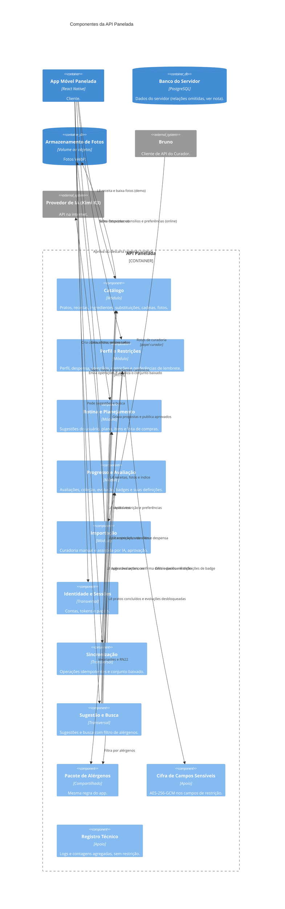

# C4 Nível 3 — Componentes — Panelada (Fase 2.5)

> Fase 2.5 — C4 níveis 1 a 3. Papel da IA: arquiteto, modelador C4.
> Destino: `/docs/fase2/c4-componentes.md`. Versão 1.0 — 07/10/2026 — status: nível 3 aprovado pela dupla (conteúdo da v0.2, sem alteração).
> Insumos: `c4-contexto.md` v1.1, `c4-containers.md` v1.1, ADR-001 a ADR-014, `casos-de-uso.md`, `modelo-conceitual.md`, `regras-de-negocio.md`.
> Escopo: componentes do **App Móvel Panelada** e da **API Panelada**. Os demais containers são armazenamento e não têm nível 3.
> Nomes dos níveis 1 e 2 mantidos: Panelada, Usuário, Curador, Bruno, Provedor de IA (Kimi K3), App Móvel Panelada, Banco Local Cifrado, API Panelada, Banco do Servidor, Armazenamento de Fotos.

## 0. Mudanças em relação à v0.1 (revisão pesada)

1. Receita e Preparo ganha relação com o Cliente de Rede (abrir candidata online) e grava a receita no banco local.
2. Rotina e Lista de Compras ganha relação com o Cliente de Rede e o Gerenciador de Fotos: criar item exige rede, e a receita é baixada nesse momento (decisão da dupla).
3. Relação App → Catálogo passa a "Lê receita e baixa fotos (demo)".
4. Definições de badge pertencem ao Progresso e Avaliação; a Sincronização lê o índice do Catálogo e do Progresso. O índice leve inclui nome de prato e de culinária.
5. Mecanismo de idempotência fica para a 2.6 (a v0.1 antecipava um "registro de operações aplicadas").
6. "Uma de cada tipo" nos lembretes marcado como hipótese (H).
7. Coluna "UC e US" renomeada para "Rastreio"; cobertura de UC corrigida (UC12 só na API); notas e rótulos corrigidos.

## 1. App Móvel Panelada

### 1.1 Diagrama

```mermaid
C4Component
  title Componentes do App Móvel Panelada

  Container_Boundary(app, "App Móvel Panelada") {
    Component(sugestoes, "Sugestões", "Feature", "Pede sugestões, aprova ou descarta.")
    Component(despensa, "Despensa", "Feature", "Cópia local de leitura; edição só online.")
    Component(receita, "Receita e Preparo", "Feature", "Abre receita, alerta de alérgenos, passo a passo, substitutos.")
    Component(rotina, "Rotina e Lista de Compras", "Feature", "Plano, datas e lista consolidada.")
    Component(perfil, "Perfil e Restrições", "Feature", "Restrições com consentimento, preferências de lembrete, conta.")
    Component(avaliacao, "Avaliação e Coleção", "Feature", "Avaliação, desbloqueio local, coleção e badges.")
    Component(lembretes, "Lembretes", "Feature", "Agendador puro e adaptador de notificações locais.")
    Component(banco, "Acesso ao Banco Local", "Núcleo", "Abre o SQLCipher, define a chave, migra e controla transações.")
    Component(fila, "Fila de Sincronização", "Núcleo", "Operações idempotentes na mesma transação do dado.")
    Component(sincronizador, "Sincronizador", "Núcleo", "Envia operações e atualiza o conjunto baixado, em primeiro plano.")
    Component(rede, "Cliente de Rede e Sessão", "Núcleo", "HTTP, conta anônima e tokens.")
    Component(fotoslocal, "Gerenciador de Fotos", "Núcleo", "Baixa e guarda fotos como arquivos, com atribuição.")
    Component(alergenos, "Pacote de Alérgenos", "Compartilhado", "Regra única de alérgenos, funções puras.")
    Component(registro, "Registro Técnico", "Apoio", "Falhas sem dado de restrição.")
  }

  ContainerDb(dblocal, "Banco Local Cifrado", "SQLite com SQLCipher", "Conjunto baixado e fila.")
  Container(api, "API Panelada", "Fastify, TypeScript", "Servidor.")
  Component_Ext(seguro, "Armazenamento seguro do Android", "expo-secure-store, Keystore", "Chave do banco e refresh token.")
  Component_Ext(notifsis, "Sistema de notificações do Android", "expo-notifications", "Dispara na data agendada (ator Tempo do UC07).")

  Rel(sugestoes, rede, "Pede sugestões e aprova ou descarta")
  Rel(despensa, rede, "Edita online")
  Rel(despensa, banco, "Lê e atualiza a cópia local")
  Rel(receita, rede, "Lê a receita online ao abrir candidata")
  Rel(receita, banco, "Lê e grava receita e substitutos")
  Rel(receita, alergenos, "Classifica receita e substitutos")
  Rel(receita, fotoslocal, "Mostra e pede fotos")
  Rel(rotina, banco, "Lê e grava plano e lista")
  Rel(rotina, fila, "Enfileira operações da rotina")
  Rel(rotina, rede, "Baixa a receita ao criar item (exige rede)")
  Rel(rotina, fotoslocal, "Pede a foto da receita")
  Rel(perfil, banco, "Lê e grava perfil")
  Rel(perfil, fila, "Enfileira restrição e preferências")
  Rel(perfil, rede, "Vincula e-mail, exclui conta")
  Rel(avaliacao, banco, "Lê índice do catálogo e histórico")
  Rel(avaliacao, fila, "Enfileira avaliação na mesma transação")
  Rel(lembretes, banco, "Lê rotina e configuração")
  Rel(lembretes, notifsis, "Agenda até 2 por dia")
  Rel(fila, banco, "Grava")
  Rel(sincronizador, fila, "Lê e atualiza estado")
  Rel(sincronizador, rede, "Envia e baixa")
  Rel(sincronizador, banco, "Atualiza conjunto baixado")
  Rel(sincronizador, fotoslocal, "Pede fotos das receitas")
  Rel(fotoslocal, rede, "Baixa")
  Rel(rede, api, "Requisições", "HTTP/JSON (TLS no alvo)")
  Rel(rede, seguro, "Guarda refresh token")
  Rel(banco, dblocal, "Lê e grava", "SQLCipher")
  Rel(banco, seguro, "Lê a chave")
```

Relação omitida por legibilidade: o Registro Técnico é usado pelo Sincronizador, pela Fila e por Lembretes.

### 1.2 Componentes

| Componente | Tipo | Responsabilidade | Rastreio | ADRs |
|---|---|---|---|---|
| Sugestões | Feature | Pede sugestões ao servidor e mostra uma por vez; aprovar (candidata) ou descartar; sinaliza utensílio ausente e ingredientes faltantes. Online. | UC01, UC02; US01, US02 | 001 |
| Despensa | Feature | Mostra a cópia local da despensa e dos utensílios; edição só online, com atualização da cópia; alimenta a sugestão pela despensa. | UC03; US03 | 001, 008 |
| Receita e Preparo | Feature | Abre receita do banco local (offline) ou do servidor (candidata, online, e grava ao abrir o passo a passo); estado e alerta de alérgenos com a data de atualização; ingredientes faltantes e substitutos filtrados pela RN22. | UC04, UC09; US05, US10 | 001, 012, 014 |
| Rotina e Lista de Compras | Feature | **Criar item exige rede** (a receita e a foto são baixadas nesse momento). Offline: reagendar, remover, definir data de compra, marcar comprado e gerar a lista consolidada, sem quantidades. Enfileira as operações. | UC05, UC06; US06, US07 | 008 |
| Perfil e Restrições | Feature | Cadastro de restrição com consentimento e revogação; preferências culinárias; frequência e tipos de lembrete; vínculo de e-mail; exclusão de conta (a confirmar se existe US ou RNF na Fase 1, ADR-007). Enfileira restrição e preferências de lembrete. | UC08, UC07 (configuração); US09, US08 | 006, 007, 008 |
| Avaliação e Coleção | Feature | Registra avaliação; calcula localmente o desbloqueio de evolução e badge (regras puras sobre o índice do catálogo); histórico, coleção por culinária e badges. | UC10, UC11, UC13; US12, US14, US15, US16 | 001, 005, 008 |
| Lembretes | Feature | Agendador puro (máx. 2 por dia; regra "uma de cada tipo" é hipótese (H), a conferir com a RN13) e adaptador de notificações locais; permissão pedida ao ativar; nunca cita restrição. | UC07; US08 | 009 |
| Acesso ao Banco Local | Núcleo | Abre o SQLCipher e define a chave logo após abrir; migrações versionadas; transações. | UC04, UC10 | 005, 006 |
| Fila de Sincronização | Núcleo | Operação com identificador gerado no cliente, tipo, carga, data, tentativas e estado (incluindo falha permanente), na mesma transação do dado. | UC05, UC08, UC10 | 005, 008 |
| Sincronizador | Núcleo | Roda ao abrir, ao reconectar e após salvar; reenvio com espera progressiva; falha permanente visível e sem bloquear as demais; atualiza o conjunto baixado (seção 3). | UC10 | 001, 008 |
| Cliente de Rede e Sessão | Núcleo | HTTP, conta anônima, tokens de acesso e refresh (em armazenamento seguro), renovação. | RNF02 | 003, 006, 007 |
| Gerenciador de Fotos | Núcleo | Baixa as fotos WebP, guarda como arquivo fora do banco cifrado, com caminho e atribuição; independe do cache de imagem. | UC04 | 005, 012 |
| Pacote de Alérgenos | Compartilhado | Funções puras: classifica receita, filtra, decide substituto (RN22). Mesma suíte de vetores do servidor; expõe a versão. | UC04, UC08, UC09 | 014 |
| Registro Técnico | Apoio | Registra falhas de sincronização e de agendamento com identificador, sem dado de restrição. | A13 | 008, 009, 014 |

## 2. API Panelada

### 2.1 Diagrama

Relações omitidas por legibilidade (mantidas na tabela): cada componente com dados próprios acessa o Banco do Servidor só nas próprias tabelas (ADR-002, item 4); Identidade e Sessões autentica todas as rotas, como plugin do Fastify; o Registro Técnico é usado por todos.

### 2.2 Componentes

| Componente | Tipo | Responsabilidade | Rastreio | ADRs |
|---|---|---|---|---|
| Catálogo | Módulo | Prato, Receita, Culinária, Ingrediente, Utensílio, substituições globais (RN15), cadeias de evolução (RN18), estado de alérgenos e fotos; só `aprovado` chega ao usuário (RN21). | UC04, UC09; US05, US10 | 002, 010, 012, 014 |
| Perfil e Restrições | Módulo | Dados do Usuário: preferências culinárias, frequência e tipos de lembrete, utensílios, despensa e restrições (cifradas; consentimento RN09; revogação em até 24 h). | UC03, UC07 (configuração), UC08; US03, US08, US09 | 002, 006, 008, 009 |
| Rotina e Planejamento | Módulo | Sugestão (apresentada, candidata, descartada), PlanoDeRotina, ItemDeRotina e ListaDeCompras (data de compra e marcações). | UC02, UC05, UC06; US02, US06, US07 | 002, 008 |
| Progresso e Avaliação | Módulo | Avaliação, histórico, coleção, evolução, badges e definições de badge (carregadas por seed pela dupla); confirma desbloqueios sem revogar (RN04). | UC10, UC11, UC13; US12, US14, US15, US16 | 002, 008 |
| Importação | Módulo | Ver tabela da seção 2.3. | UC12; US18, US10 | 002, 007, 010, 011, 012, 013, 014 |
| Identidade e Sessões | Transversal | Conta anônima; e-mail e senha opcionais (Argon2id); JWT de acesso curto; refresh token opaco, com hash e rotação; revogação; papéis usuário e curador; limite de tentativas; exclusão de conta; um aparelho ativo. | RNF02; US09; UC12 (papel curador) | 007, 008 |
| Sincronização | Transversal | Recebe operações com identificador estável e despacha às interfaces públicas dos módulos; o mecanismo de idempotência é definido na 2.6. Monta o conjunto baixado (seção 3). | UC05, UC08, UC10 | 001, 002, 008 |
| Sugestão e Busca | Transversal | Sugestões e busca com filtro de alérgenos; combina catálogo, perfil, progresso e rotina só por interfaces públicas. | UC01, UC03; US01, US03; RN08 e RN10 (citam US04 e US11) | 001, 002, 014 |
| Pacote de Alérgenos | Compartilhado | Mesma regra e mesma suíte do app; invariantes do catálogo. | UC01, UC04, UC09 | 014 |
| Cifra de Campos Sensíveis | Apoio | AES-256-GCM; IV de 12 bytes novo a cada gravação; etiqueta de 16 bytes; versão da chave; identificador do usuário como dado adicional autenticado; chave fora do banco. | US09 | 006 |
| Registro Técnico | Apoio | Falhas de sincronização e de importação, violações de invariante, contagens agregadas por resultado e versão do pacote; nunca restrição. | A13 | 008, 014 |

### 2.3 Partes internas do módulo Importação

Estas partes aparecem em tabela, e não como componentes do diagrama, por **legibilidade**. Detalhadas, acrescentariam seis elementos e cerca de dez relações a um diagrama que já tem os módulos de domínio, os três transversais e os componentes de apoio. Elas colaboram só entre si e com o Catálogo, por uma única relação ("grava propostas e publica aprovados"); mostrar a relação do módulo inteiro preserva a leitura da fronteira modular (ADR-002). O detalhe interno vira classes e sequência na 2.6.

| Parte | Responsabilidade | ADRs |
|---|---|---|
| Rotas de Curadoria | Enviar receita manual; enviar texto para importação assistida; listar `proposto`; editar; aprovar; marcar alérgenos verificados; descartar. Só papel curador. | 007, 010 |
| Agente de Importação | Traduz, extrai, mapeia ingredientes canônicos e propõe alérgenos e substitutos. Atrás da Interface de Provedor de IA, com os adaptadores Kimi K3 e gravado (falso). JSON Mode validado por esquema. | 011 |
| Controle de Consumo de IA | Tabela de consumo; teto de R$ 20; aviso a 80% e bloqueio a 100%. | 011, 013 |
| Portão de Publicação | Bloqueia por campo faltante (A09), fonte (RN17) e invariantes do ADR-014. | 010, 014 |
| Processamento de Fotos | Redimensiona (até 1.024 px), recomprime em WebP e nomeia por hash; registra atribuição. | 012 |
| Seed e comando de auditoria | Carga inicial pelo mesmo serviço do fluxo manual; auditoria das invariantes; criação da conta de curador. | 007, 010, 014 |

## 3. Conjunto baixado em três camadas (decisão da dupla)

A Sincronização monta, e o Sincronizador aplica, o conjunto em três camadas:

1. **Texto leve, sempre:** perfil, restrições, preferências, despensa e utensílios (cópia de leitura), rotina, lista de compras, avaliações, badges e o **índice leve do catálogo** (identificadores e nomes de pratos e culinárias, cadeias de evolução, continente de cada culinária, definições de badge, totais por culinária). Sem receita nem foto.
2. **Pesado, sempre:** receita completa e foto das planejadas e em preparo, com a data de atualização dos alérgenos e os substitutos. Uma receita planejada entra aqui quando o item é criado, com rede.
3. **Preparadas:** as já baixadas permanecem no aparelho; em instalação nova, voltam sob demanda, quando o usuário as abre com rede.

Candidatas não ficam offline. O tamanho do índice leve é hipótese, a medir junto com o conjunto do seed (ADR-012).

## 4. Detalhamentos de ADR decididos na 2.5

| # | Detalhamento | ADRs afetados |
|---|---|---|
| 1 | Preferências de lembrete ficam no módulo Perfil e Restrições (frequência e tipos são atributos de `Usuario`). | 002, 009 |
| 2 | Identidade e Sessões, Sincronização e Sugestão e Busca como componentes transversais, que orquestram só por interfaces públicas. | 002 |
| 3 | Despensa, utensílios e preferências culinárias: cópia local de leitura, edição só online; sem alterar o item 3 do ADR-008. | 001, 008 |
| 4 | Índice leve do catálogo no aparelho (sem receita nem foto), para desbloqueio, badges e coleção offline. | 001, 008 |
| 5 | Conjunto baixado em três camadas (seção 3). | 001, 008, 012 |
| 6 | Componentes de apoio: Sincronizador e Registro Técnico no app; Cifra de Campos Sensíveis e Registro Técnico na API. | 006, 008, 014 |
| 7 | Chave da IA no Secret Manager e fotos do alvo por URL estática (nível 2). | 004, 011, 012 |
| 8 | Criar item de plano exige rede (a receita é baixada nesse momento). Offline continuam: reagendar, remover, data de compra, marcar comprado e avaliar. | 001, 008 |
| 9 | Data de compra e marcações da lista de compras sincronizam como operações de rotina (a Rotina e Planejamento do servidor é dona da lista). | 008 |
| 10 | Definições de badge pertencem ao Progresso e Avaliação, carregadas por seed pela dupla. | 002 |

## 5. Conferência de nomes e cobertura

| Nome | Nível 1 | Nível 2 | Nível 3 |
|---|---|---|---|
| Panelada, Usuário, Curador | sim | sim | Usuário e Curador por UC |
| Bruno, Provedor de IA (Kimi K3) | sim | sim | sim (API) |
| App Móvel Panelada, API Panelada | | sim | sim (fronteiras) |
| Banco Local Cifrado | | sim | sim (app) |
| Banco do Servidor, Armazenamento de Fotos | | sim | sim (API) |
| Pacote de Alérgenos | | citado (ADR-014) | sim, nos dois containers |

- Todo módulo do ADR-002 aparece: Catálogo, Perfil e Restrições, Rotina e Planejamento, Progresso e Avaliação, Importação. Não há módulo de notificações no servidor (ADR-009).
- Todos os 14 ADRs têm pelo menos um elemento: ADR-003 (App), ADR-004 (implantação), ADR-013 (Controle de Consumo de IA e implantação do alvo), os demais nas tabelas acima.
- **Cobertura de UC:** UC01 a UC11 e UC13 aparecem em componentes do app e da API. O UC12 aparece só na API (Importação), porque o Curador usa o Bruno e não o app.

## 6. Pontos em aberto para a 2.6

- Mecanismo de idempotência e esquema de saída do agente (ADR-008, ADR-011).
- Estado "em preparo": existe como status de `ItemDeRotina` no modelo conceitual; falta definir o prato aberto sem item de rotina e se ele sincroniza.
- Caminho de definição de badges de conjunto temático (RN03e): fora do UC12 e do ADR-010; por ora, seed.
- Vocabulário de alérgenos e critério de "verificado".
- Verificação das fronteiras entre módulos (2.7).

## 7. Conferência com a Definition of Done (2.5)

- Níveis 1 a 3 coerentes, com os mesmos nomes: sim (seção 5).
- Atores e sistemas externos presentes: sim (Usuário, Curador, Bruno, Provedor de IA, sistemas do Android).
- Cada container ligado a pelo menos um ADR: sim (`c4-containers.md`, seções 2 e 7).
- Os diagramas Mermaid C4 não foram renderizados; se o layout ficar ilegível, trocar por fluxogramas Mermaid com a convenção C4.
