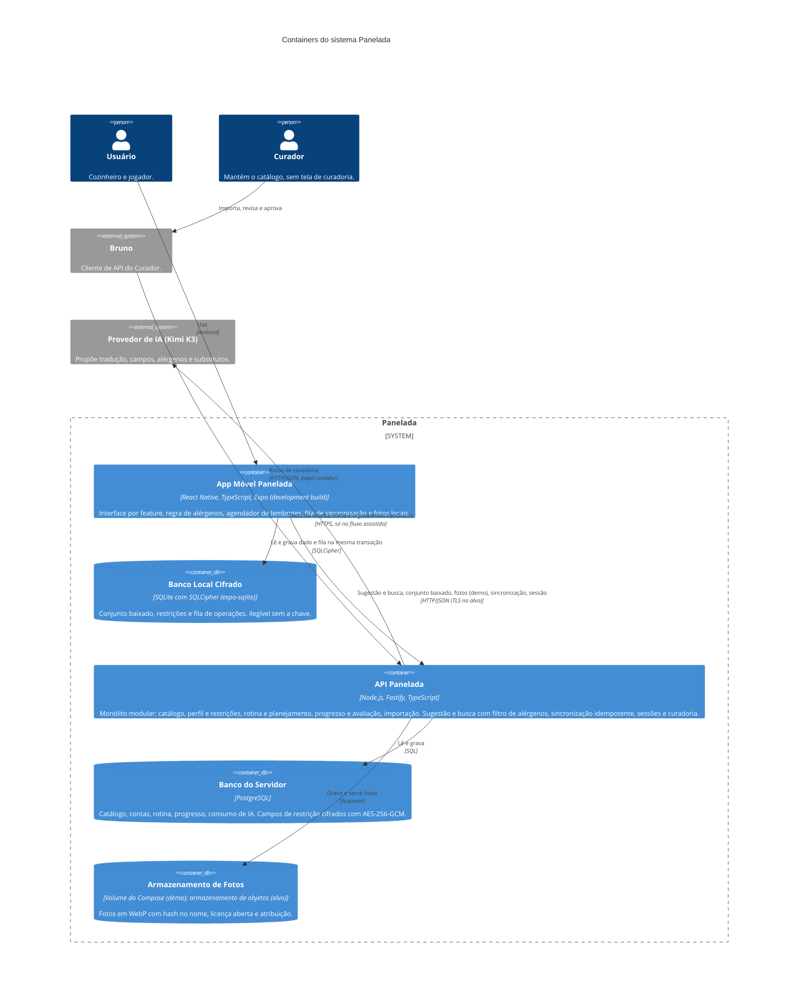
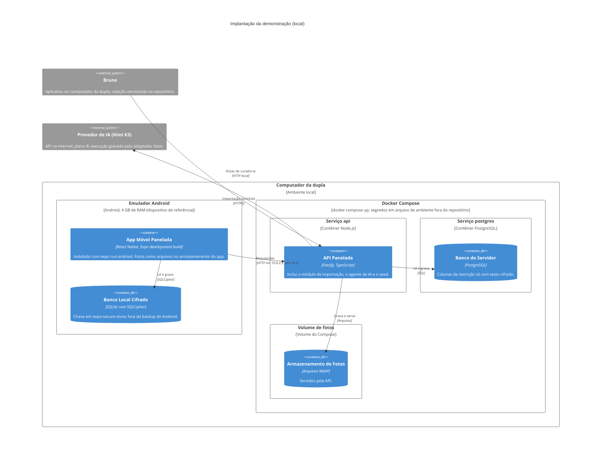
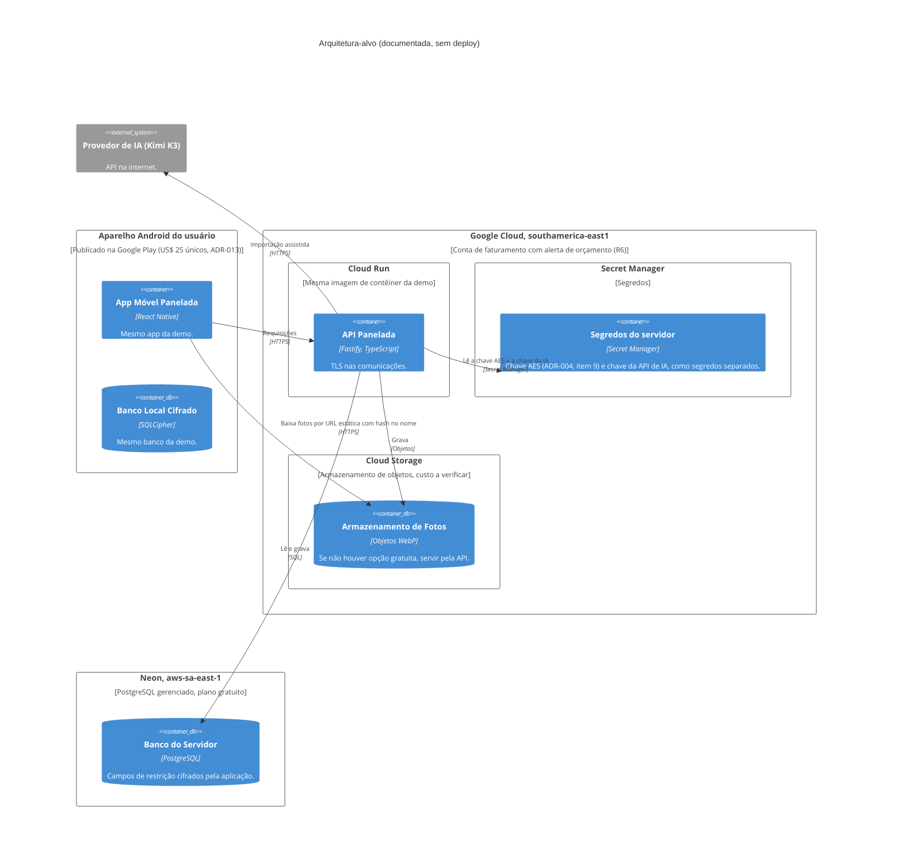

# C4 Nível 2 — Containers e implantação — Panelada (Fase 2.5)

> Fase 2.5 — C4 níveis 1 a 3. Papel da IA: arquiteto, modelador C4.
> Destino: `/docs/fase2/c4-containers.md`. Versão 1.1 — 06/10/2026 — status: nível 2 fechado pela dupla.
> Alterações da v1.1 (revisão do nível 3): rastreio da API e do Banco do Servidor corrigido para UC01 a UC13; US16 acrescentada ao rastreio do App Móvel.
> Insumos: `c4-contexto.md` v1.1, ADR-001 a ADR-014, `propostas-arquiteturais.md` v1.2, `atributos-qualidade.md` v1.2.
> Nomes herdados do nível 1: Panelada, Usuário, Curador, Bruno, Provedor de IA (Kimi K3).

## 1. Diagrama de containers

## 2. Containers

| Container | Tecnologia | Responsabilidade | Atributos | Rastreio (UC e US) | ADRs |
|---|---|---|---|---|---|
| App Móvel Panelada | React Native + TypeScript, Expo (development build), Android | Telas por feature; regra de alérgenos para abrir receita offline; agendador de lembretes (máx. 2 por dia); fila de sincronização; download de fotos; tokens em expo-secure-store | A04, A06, A08, A07, A02 | UC01 a UC11, UC13; US01 a US03, US05 a US10, US12, US14 a US16 | 001, 003, 005, 006, 007, 008, 009, 012, 014 |
| Banco Local Cifrado | SQLite + SQLCipher; chave de 256 bits em expo-secure-store | Conjunto baixado, restrições, fila na mesma transação; fora do backup do Android | A04, A05, A08 | UC04, UC08, UC10 | 001, 005, 006, 008 |
| API Panelada | Node.js, Fastify, TypeScript; uma imagem de contêiner | Sugestão e busca com filtro de alérgenos; entrega do conjunto baixado; sincronização idempotente; sessões; importação (manual e assistida); consumo e teto de IA | A06, A05, A08, A09, A12, A13 | UC01 a UC13 | 002, 004, 006, 007, 008, 010, 011, 014 |
| Banco do Servidor | PostgreSQL; AES-256-GCM de aplicação nos campos de restrição | Fonte de verdade do catálogo; cópia do progresso; campos de restrição cifrados | A05, A08, A09 | UC01 a UC13 | 004, 006 |
| Armazenamento de Fotos | Volume do Compose (demo); armazenamento de objetos (alvo, a verificar) | Fotos WebP (até 1.024 px) com atribuição | A09, A04 | UC04, UC12 | 004, 012, 013 |

As fotos locais do app são arquivos no armazenamento do app, fora do banco cifrado (ADR-005, item 5). Elas são modeladas como componente do App no nível 3 (gerenciador de fotos), e não como container.

## 3. Relações

| Relação | Observação |
|---|---|
| App → Banco Local Cifrado | Chave definida logo após abrir o banco; avaliação e operação da fila na mesma transação (ADR-005). |
| App → API | Na demo, o emulador acessa o host por `10.0.2.2`, sem TLS (ADR-003, ADR-006). A API entrega o conjunto baixado e, na demo, as fotos. |
| API → Banco do Servidor | O servidor decifra a restrição em memória para filtrar e nunca a registra em log (ADR-006). |
| API → Armazenamento de Fotos | Processa (WebP, hash no nome). Na demo, serve as fotos ao app. No alvo, o app baixa direto do armazenamento por URL estática (seção 6). |
| API → Provedor de IA | Nenhum dado de usuário (RNF06, R11); teto de R$ 20 (ADR-011, ADR-013). |

## 4. Implantação da demonstração (foco principal)

| Item da demo | Detalhe | ADR |
|---|---|---|
| Serviços do Compose | Dois: `api` e `postgres`. O volume de fotos não é serviço. | 004 |
| Segredos | Chave AES (servidor) e chave da API de IA, em arquivo de ambiente fora do repositório. | 004, 006, 011 |
| Seed | Cerca de 20 pratos, pelo mesmo serviço de importação; também cria a conta de curador (seed ou comando). | 004, 007, 010 |
| Internet | Só a importação assistida a exige; plano B é a execução gravada ou o fluxo manual. | 004, 011 |
| Medições na demo | A04, A06, A05, A08 e A09. A01 mede só a lógica; A11 não é medido (R5). | 004 |
| Limitações declaradas | Sem TLS na demo; emulador no lugar de aparelho real. | 003, 006 |

## 5. Implantação do alvo (apenas documentada)

Notas do alvo:
- **Alternativa registrada:** Azure (App Service e PostgreSQL com crédito de estudante), sem depender do crédito (ADR-004).
- **Plano B de backend:** Supabase (P2), só se o protótipo de sincronização passar de 10 dias (ADR-001, ADR-004).
- **iOS:** só com Mac; App Store US$ 99 por ano (ADR-013).
- **Fotos:** se não houver opção gratuita de armazenamento de objetos, o app volta a baixar pela API, como na demo (ADR-012).
- **Hipóteses:** A01 e A11 (cold start, cotas, latência) não são medidas; cota do Cloud Run em São Paulo e hospedagem de fotos seguem a verificar.

## 6. Decisões de detalhamento (dupla, 06/10/2026)

Registradas como detalhamento dos ADRs, sem ADR novo.

1. **Chave da API de IA no alvo (ADR-004, ADR-011):** fica no Secret Manager, como segredo separado da chave AES. Na demo continua no arquivo de ambiente fora do repositório.
2. **Fotos no alvo (ADR-012):** o app baixa direto do armazenamento de objetos, por URL estática com hash no nome (conteúdo imutável, seguro de cachear e idempotente). Na demo, o download é pela API. Se não houver opção gratuita no alvo, o download volta a ser pela API.

## 7. Matriz container × ADR

Legenda: ● decisão principal do container; ○ relacionado.

| ADR | App Móvel | Banco Local | API | Banco do Servidor | Fotos | Implantação ou externo |
|---|---|---|---|---|---|---|
| 001 Offline-first | ● | ● | ○ | ○ | | |
| 002 Monólito modular | | | ● | | | |
| 003 Stack móvel | ● | | | | | Emulador |
| 004 Demo e alvo | | | ○ | ● | ○ | ● |
| 005 Armazenamento local | ○ | ● | | | | |
| 006 Criptografia | ○ | ● | ● | ● | | |
| 007 Autenticação | ○ | | ● | ○ | | |
| 008 Sincronização | ● | ● | ● | | | |
| 009 Notificações | ● | | | | | |
| 010 Catálogo e importação | | | ● | ○ | | Bruno |
| 011 Agente de IA | | | ● | ○ | | Provedor de IA |
| 012 Fotos | ○ | | ○ | | ● | |
| 013 Custos | | | ○ | | ○ | ● (alvo e IA) |
| 014 Regra de alérgenos | ● | | ● | | | Pacote compartilhado (nível 3) |

Todo ADR tem pelo menos um container ou elemento de implantação, e todo container tem pelo menos um ADR principal.

## 8. Conferência com a Definition of Done (2.5, nível 2)

- Mesmos nomes do nível 1: sim (Panelada, Usuário, Curador, Bruno, Provedor de IA).
- Atores e sistemas externos presentes: sim.
- Cada container ligado a pelo menos um ADR: sim (seção 2 e seção 7).
- Nível 4: não feito; no lugar, dois diagramas de implantação, com foco na demo.
