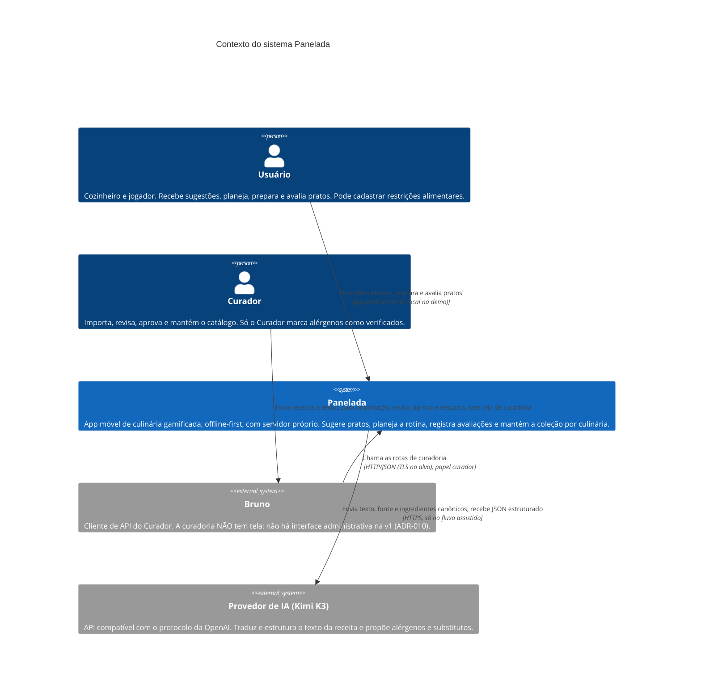

# C4 Nível 1 — Contexto do sistema — Panelada (Fase 2.5)

> Fase 2.5 — C4 níveis 1 a 3. Papel da IA: arquiteto, modelador C4.
> Destino: `/docs/fase2/c4-contexto.md`. Versão 1.1 — 06/10/2026 — status: nível 1 fechado pela dupla.
> Alteração da v1.1: US16 (badges) acrescentada ao rastreio do Usuário.
> Insumos: `briefing-passagem-2.5.md`, `briefing-fase2.md` (v1.2), `diario_de_bordo-fase2.md` (com a entrada 2.4), `propostas-arquiteturais.md` v1.2, ADR-001 a ADR-014, `estilo-arquitetural.md` v1.1, `atributos-qualidade.md` v1.2, `casos-de-uso.md`.
> Convenção: os nomes deste arquivo valem para os níveis 2 e 3. "Usuário" (com acento) corresponde à classe `Usuario` da Fase 1.

## 1. Diagrama

## 2. Elementos

| Elemento | Tipo | Responsabilidade | Rastreio |
|---|---|---|---|
| Usuário | Pessoa | Usa o app: sugestões, receita, despensa, plano, lista de compras, lembretes, restrições, avaliação, coleção e badges. | UC01 a UC11 e UC13; US01 a US03, US05 a US10, US12, US14 a US16 (a US16 não tem UC próprio; aparece no UC10) |
| Curador | Pessoa | Mantém o catálogo (UC12): fluxo manual ou assistido, aprovação, estado dos alérgenos. | UC12, US18; RN15, RN17, RN21 |
| Panelada | Sistema | Todo o sistema construído pela dupla (app, API e dados). Detalhado no nível 2. | ADR-001, ADR-002 |
| Bruno | Sistema externo | Interface de curadoria da API. Não existe tela de curadoria na v1; tudo passa por rotas chamadas pelo Bruno (ADR-010). Tela administrativa é Could. A coleção fica versionada no repositório. | ADR-010 |
| Provedor de IA (Kimi K3) | Sistema externo | Assistente opcional da curadoria. Propõe, nunca decide: o Curador aprova e só ele marca "verificado". Atrás de interface de provedor, substituível. | ADR-011; US10, US18; RN15, RN21, RN22; RNF06 |

## 3. Relações e restrições

| Relação | Restrição |
|---|---|
| Usuário → Panelada | Na demo, o app roda no emulador Android e fala com a API por HTTP local, sem TLS (limitação declarada, ADR-003 e ADR-006). |
| Curador → Bruno | Sem tela de curadoria (ADR-010). |
| Bruno → Panelada | Rotas restritas ao papel de curador, criado pela dupla por seed ou comando (ADR-007). TLS no alvo. |
| Panelada → Provedor de IA | Só texto da receita, fonte e link, e lista de ingredientes canônicos. **Nenhum dado de usuário nem restrição alimentar** (RNF06, R11). Teto de gasto de R$ 20, controlado no servidor (ADR-011, ADR-013). |

## 4. Fora do diagrama (de propósito)

- **Distribuição por loja (Google Play, App Store):** não é dependência de execução. Aparece só na implantação do alvo (ADR-004, ADR-013). Decisão da dupla em 06/10/2026.
- **Fontes de receitas:** o Curador lê a fonte e cola o texto. Não há integração; o agente não navega na web (ADR-010, ADR-011).
- **Seed e comando de auditoria:** executados pela dupla com o mesmo serviço de importação (ADR-010, ADR-014).
- **Ator "Tempo" (UC07):** vira o agendador de notificações do app (ADR-009). Aparece no nível 3.
- **Sistema operacional Android** (notificações, Keystore): aparece na implantação (nível 2) e nos componentes do app (nível 3).
- **Hospedagem do alvo** (Cloud Run, Neon, Secret Manager): infraestrutura, mostrada na implantação (nível 2).

## 5. Conferência com a Definition of Done (2.5, nível 1)

- Atores presentes: Usuário e Curador.
- Sistemas externos presentes: Bruno e Provedor de IA (Kimi K3).
- Cada elemento tem rastreio a UC, US ou ADR.
- Nomes a manter nos níveis 2 e 3: Panelada, Usuário, Curador, Bruno, Provedor de IA (Kimi K3).

## 6. Decisões da dupla neste nível (06/10/2026)

1. Bruno mantido como sistema externo, com a ausência de tela de curadoria explícita.
2. Google Play removido do nível 1; entra como nota na implantação do alvo.
3. Acentos mantidos nos nomes dos diagramas.
4. Nome "Provedor de IA (Kimi K3)" válido nos três níveis.

## 7. Divergências registradas

Ver `registro-divergencias-2.5.md`.
