# Diagrama de classes de projeto — Panelada (Fase 2.6, v1.1 da 2.7)

> Fase 2.6 — Classes, sequências e contratos; revisão da 2.7. Papel da IA: arquiteto, designer de componentes e de padrões (SOLID).
> Destino: `/docs/fase2/diagrama-classes.md`. Versão 1.1 — 07/10/2026 — status: a revisar pela dupla.
> Insumos: `c4-contexto.md` v1.1, `c4-containers.md` v1.1, `c4-componentes.md` v1.1, ADR-001 a ADR-015, `modelo-conceitual.md`, `casos-de-uso.md`, `regras-de-negocio.md`, `atributos-qualidade.md` v1.3, `propostas-arquiteturais.md` v1.2, `padroes-de-projeto.md` v1.1, `glossario-identificadores.md`.
> Escopo: classes de projeto do **Pacote de Alérgenos**, da **API Panelada** e do **App Móvel Panelada**, rastreadas às 13 classes do modelo conceitual. Os nomes dos componentes (em português) seguem o `c4-componentes.md`; a pasta de cada um está no glossário, seção 8.

## Alterações da v1.1 (motivo: conversa 2.7)

1. **Identificadores em inglês** (ADR-015, escopo B), pelo glossário aprovado. Textos continuam em português. Nomes de atributos e de métodos foram traduzidos pela mesma regra (seção 9 do glossário, a aprovar).
2. **Contexto transacional `Tx`** (T01): toda interface pública que escreve recebe `tx: Tx`, tipo opaco de `src/shared/`.
3. **`OperationApplier`** passa para `src/shared/`, para que os módulos de domínio não importem a Sincronização (regra S2).
4. **`PublicationGate`** deixa de ser classe: é uma função com verificações privadas (R02).
5. **`UnlockRules`** entra no módulo `progress` do servidor, pura, com os mesmos vetores de teste do `UnlockCalculator` do app (decisão B da 2.7).
6. Seção 13.3 fechada; seção 14 registra a verificação das fronteiras; seção 15 lista o mapeamento v1.0 → v1.1.

## 0. Como ler

- Diagramas Mermaid `classDiagram`, no máximo cerca de 12 elementos cada, divididos por assunto (lição da 2.5).
- `<<interface>>` é a fronteira que outros componentes usam. Uma seta tracejada (`..>`) é dependência de uso. Uma seta cheia (`-->`) é associação de dados.
- Atributos e métodos mostram só o que importa ao contrato. Tipos TypeScript detalhados ficam na implementação.
- Os 12 ajustes da conferência de SOLID (seção 13) e as decisões da 2.7 já estão aplicados nos diagramas.

## 1. Rastreio ao modelo conceitual

| Conceito (Fase 1) | Classe de projeto | Onde | Observação |
|---|---|---|---|
| Usuario | `User` | API (Perfil e Restrições); App (cópia local) | A conta de acesso é `Account` (Identidade e Sessões), com a mesma chave primária. |
| RestricaoAlimentar | `RestrictionType` e `UserRestriction` | API; App | O tipo é catálogo fixo por seed. A escolha do usuário é cifrada no servidor e na fila. A revogação apaga a linha. |
| Utensilio | `Utensil` | API (Catálogo); App | |
| Ingrediente | `Ingredient` | API (Catálogo); App | Ganha `allergens` (19 códigos) e `lactoseFree`. |
| Culinaria | `Cuisine` | API (Catálogo); App (índice leve) | |
| Prato | `Dish` | API (Catálogo); App (índice leve) | Prato aprovado nunca é apagado, só desativado. |
| Receita | `Recipe` | API (Catálogo); App (conjunto baixado) | Ganha `allergenState` e `allergensUpdatedAt`. |
| Sugestao | `Suggestion` | API (Rotina e Planejamento) | O módulo Rotina é dono do ciclo `presented`, `candidate`, `discarded`. |
| PlanoDeRotina | `RoutinePlan` | API (Rotina e Planejamento); App | |
| ItemDeRotina | `RoutineItem` | API; App | Servidor só conhece `planned` e `completed`. "Em preparo" é local (`LocalCookingState`). |
| ListaDeCompras | `ShoppingList` e `ShoppingItem` | API; App | `ShoppingItem` promove a associação com `purchased`. |
| Avaliacao | `Rating` | API (Progresso e Avaliação); App | O `id` é o `opId` gerado no cliente. |
| Badge | `BadgeDefinition` e `BadgeAward` | API; App (índice leve) | A conquista promove a associação com `unlockedAt`. |

Classes de projeto sem equivalente conceitual: `IngredientSubstitution` (promove a autoassociação de Ingredient), `EvolutionUnlock` (confirmação do servidor, RN02 e RN04), `Account` e `RefreshSession` (RNF02, ADR-007), `QueuedOperation` e `ProcessedOperation` (ADR-008) e as classes técnicas dos componentes.

## 2. Pacote de Alérgenos (compartilhado)

Rastreio: UC01, UC04, UC08, UC09; RN08, RN10, RN16, RN22; ADR-014; A06. Pasta: `packages/allergen-rules`.

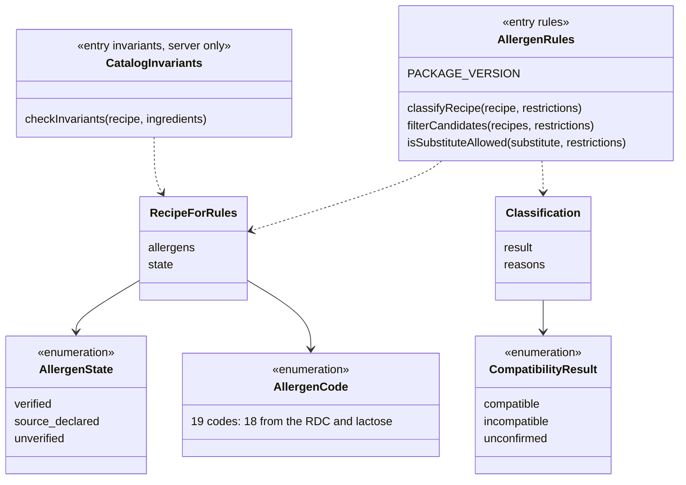

- As funções são puras: sem banco, rede, disco nem log (ADR-014, itens 2, 6 e 9).
- Receita sem restrição cadastrada classifica como `compatible`; o estado dos alérgenos continua visível (RN16). Com restrição, vale a RN08 completa. "Declarado pela fonte" é `compatible` quando não há alérgeno da restrição, sempre com o aviso "compatibilidade não confirmada".
- `CatalogInvariants` é um ponto de entrada separado, para o app não carregar o que só o servidor usa (regra A7). Invariantes: estado de alérgenos presente; `verified` com lista vazia só com `confirmedAllergenFree`; união dos alérgenos dos ingredientes igual à da receita; substituto sem alérgenos nunca `verified`; ingrediente com `leite` e sem `lactose` só com `lactoseFree = true`.
- A versão do pacote é exposta por cliente e servidor. O app envia a versão no cabeçalho `X-Allergen-Package-Version`, e a API responde `minPackageVersion`. O app avisa e não bloqueia.

## 3. API: fronteiras entre módulos

Rastreio: ADR-002 (regra de fronteira); `c4-componentes.md` 2.1; `padroes-de-projeto.md` P06 e T01. Cada módulo só é acessado pelas interfaces abaixo, em `public/`. Métodos que escrevem recebem `tx: Tx`.

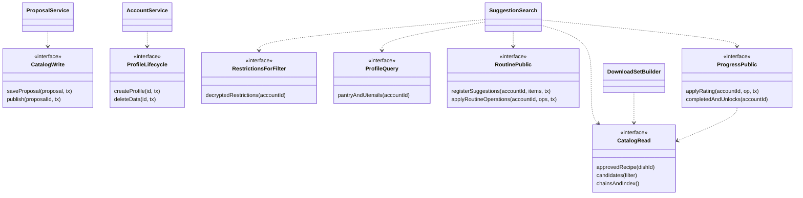

- Só `SuggestionSearch` recebe a restrição decifrada (`RestrictionsForFilter`). Nenhum outro consumidor consegue pedi-la (regra S3).
- `ProposalService` é o único consumidor de `CatalogWrite` (UC12, regra S4).
- Quem implementa `aprovar` e `descartar` de sugestão é `RoutinePublic`. As rotas aparecem no grupo "Sugestão e busca" do OpenAPI por afinidade de uso.
- `Tx` é opaco: o módulo dono o repassa às suas tabelas sem conhecer o driver (T01). `SyncService` abre a transação, passa o `tx` ao aplicador e grava `ProcessedOperation` com o mesmo `tx`. `AccountService` passa o mesmo `tx` a `ProfileLifecycle.createProfile`.

## 4. API: Catálogo

Rastreio: UC04, UC09, UC12; RN15, RN17, RN18, RN21, RN22; ADR-010, ADR-012, ADR-014.

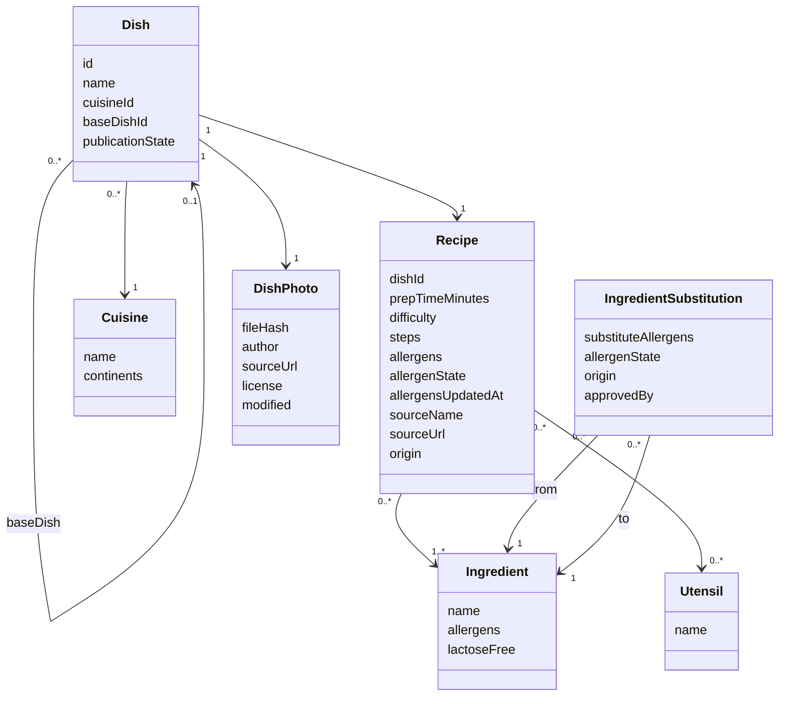

`publicationState` assume `proposed`, `approved` ou `deactivated`. Só `approved` chega ao usuário. A proposta de IA, com saída bruta, modelo e tokens, fica no módulo Importação (seção 8).

## 5. API: usuário, rotina e progresso

Rastreio: UC01 a UC03, UC05, UC06, UC08, UC10, UC11, UC13; RN01 a RN07, RN09, RN11, RN12, RN14.

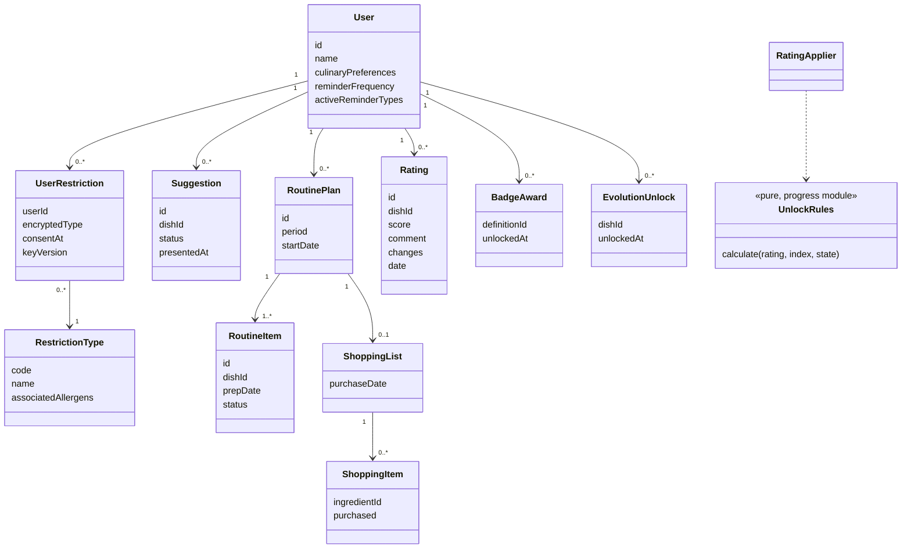

- `score` é um inteiro de 0 a 10, em meios-pontos (RN05). A interface mostra 0 a 5 em passos de 0,5.
- `RoutineItem.status` no servidor só assume `planned` ou `completed`. O `id` do item é o `opId` da operação que o cria. Cada operação seguinte tem `opId` próprio.
- Avaliações, conquistas e desbloqueios só se acrescentam (RN04, RN06, RNF09). Não há edição nem exclusão de avaliação, exceto na exclusão de conta.
- `encryptedType` usa AES-256-GCM, com versão da chave e a conta como dado autenticado (ADR-006). A revogação apaga a linha.
- `BadgeDefinition` guarda o `milestone` tipado (`dish`, `cuisine`, `n_cuisines`, `all_continents`, `set`), carregado por seed.
- `UnlockRules` (nova na v1.1) recalcula desbloqueios no servidor, só acrescentando. É pura e passa pelos mesmos vetores de teste do `UnlockCalculator` do app. Os cinco tipos de marco são tratados por `switch` sobre união discriminada, com checagem `never`.

## 6. API: Identidade e Sessões

Rastreio: RNF02; US09 (exclusão de conta); UC12 (papel curador); ADR-007, ADR-008.

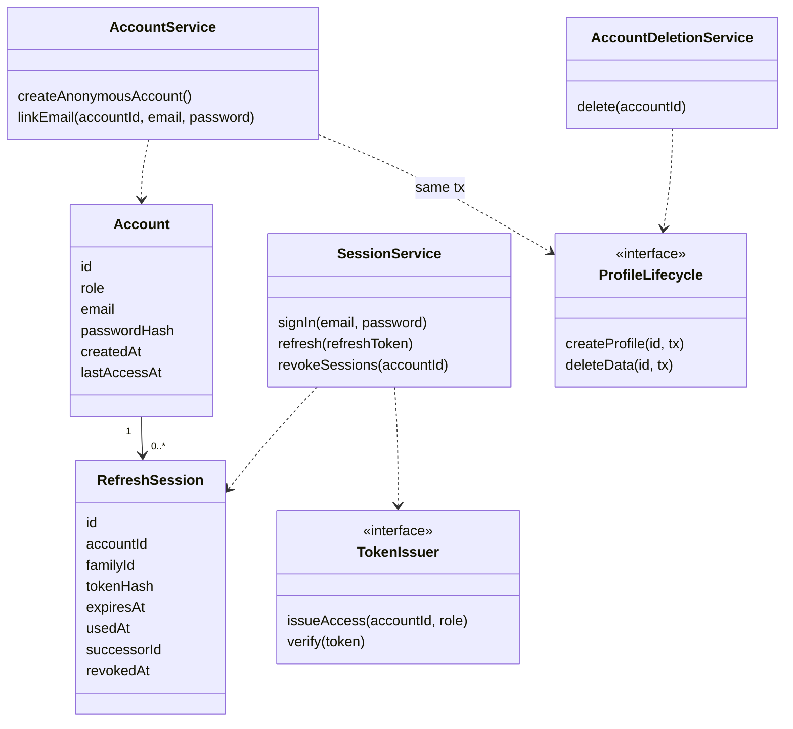

- O JWT de acesso dura 45 minutos e carrega só `accountId` e papel. O refresh dura 30 dias, é opaco, de uso único e guardado com hash.
- Reenvio do mesmo refresh dentro de 60 s do primeiro uso devolve o mesmo par (via `successorId`). Reuso fora da janela revoga a `familyId` inteira.
- Conta anônima sem sincronização por 12 meses é excluída com seus dados. Quem vinculou e-mail não é excluído por inatividade.
- `AccountDeletionService` chama a interface de exclusão de cada módulo (com `tx`) e remove as `ProcessedOperation` da conta. Um comando de auditoria verifica que toda conta com papel `user` tem exatamente um perfil.

## 7. API: Sincronização

Rastreio: UC05, UC08, UC10; ADR-008; decisões da 2.6 sobre idempotência; P01, P05.

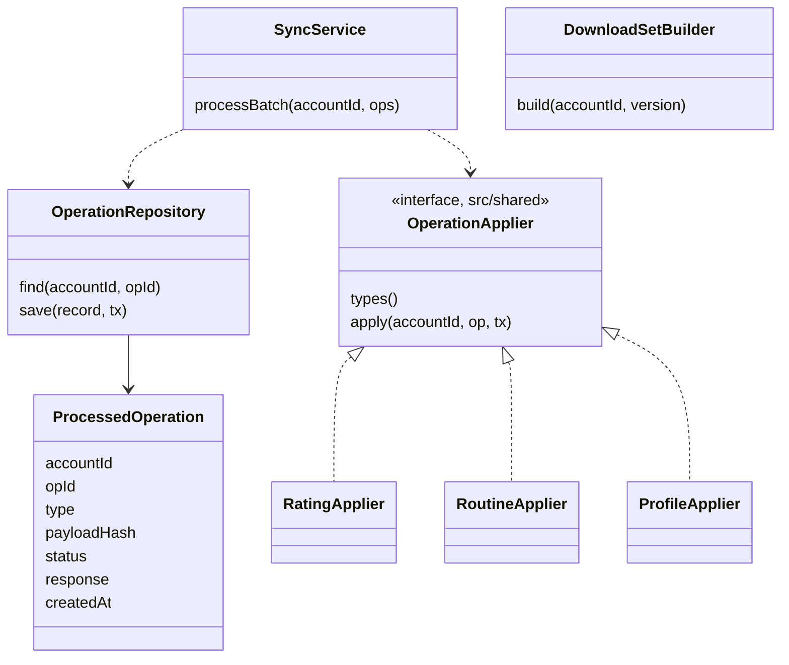

- Chave de idempotência: `(accountId, opId)`. Mesmo `opId` e mesmo `payloadHash` devolvem a resposta gravada com `repeated = true`. Mesmo `opId` com hash diferente é recusado (422, `key-reused`). Validade de 90 dias.
- O aplicador e o registro em `ProcessedOperation` ficam na **mesma transação**: `SyncService` abre o `tx`, passa-o ao aplicador e a `OperationRepository.save`.
- Cada aplicador fica no módulo dono do tipo (`RatingApplier` em `progress`, `RoutineApplier` em `routine`, `ProfileApplier` em `profile`) e é registrado na raiz de composição (`src/app.ts`) em um `Map<tipo, aplicador>`.
- O serviço falha na inicialização se dois aplicadores declararem o mesmo tipo, ou se um tipo da lista de oito não tiver aplicador. Os tipos: `rating.register`, `item.reschedule`, `item.remove`, `list.set_purchase_date`, `list.mark_item`, `restriction.register`, `restriction.revoke`, `reminders.set`.
- O servidor recalcula os desbloqueios (`UnlockRules`) e só acrescenta. Nunca revoga (RN04).

## 8. API: Importação e Cifra

Rastreio: UC12 (FA2); US10, US18; RN15, RN17, RN21, RN22; ADR-006, ADR-010, ADR-011, ADR-012, ADR-013.

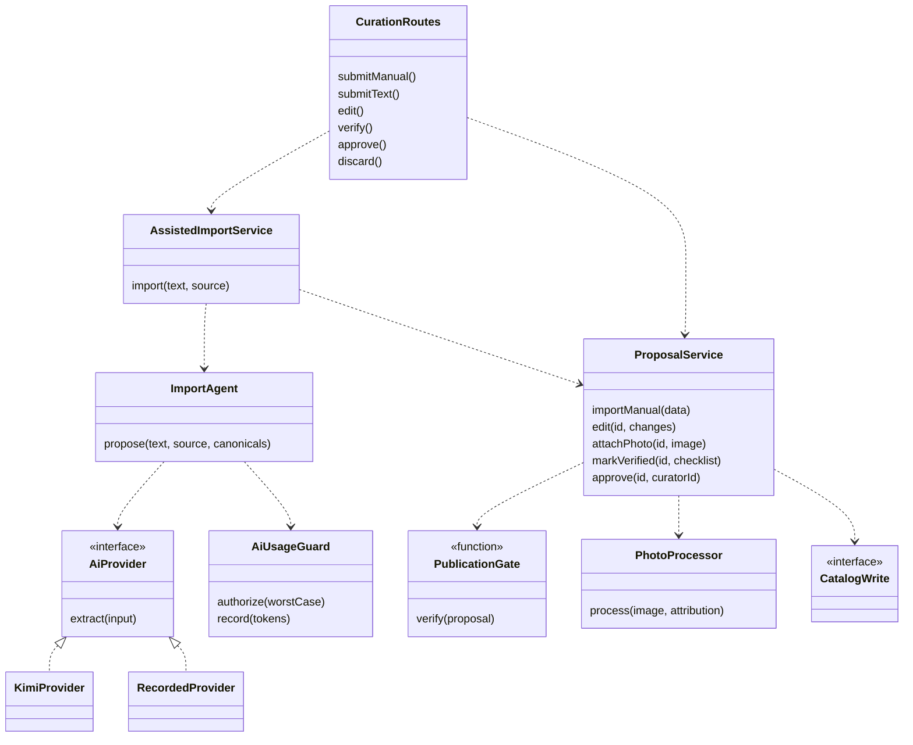

- **Cifra de Campos Sensíveis** (componente de apoio, usado só pelo módulo `profile`, regra S5): `FieldCipher` recebe a chave por uma interface `KeyProvider`, com `FileKey` (demo) e `SecretManagerKey` (alvo). A chave de IA fica em segredo separado.
- O servidor atribui `unverified` a todo alérgeno proposto, preenche fonte e link a partir do curador e descarta ids canônicos inexistentes e códigos fora do vocabulário (ADR-011, item 4).
- `PublicationGate` é **uma função** com uma verificação privada por regra (R02). Ela chama `CatalogInvariants.checkInvariants` e bloqueia por campo da A09, fonte (RN17), foto sem os quatro elementos de atribuição ou invariante violada. Devolve todas as violações. Aprovar não exige `verified`.
- Os dois adaptadores de `AiProvider` passam a mesma suíte de contrato (mesmo esquema de saída, mesmos erros, mesmo registro de tokens). O gravado só é selecionado por `PROVEDOR_IA=gravado` e marca `model = "recorded"`.
- Falha do provedor ou saída inválida após uma tentativa de correção não grava proposta. Os tokens consumidos são registrados.

## 9. App: dados locais e fila

Rastreio: UC04, UC05, UC08, UC10; A04, A05, A08; ADR-005, ADR-006, ADR-008; P02a, P03, P04.

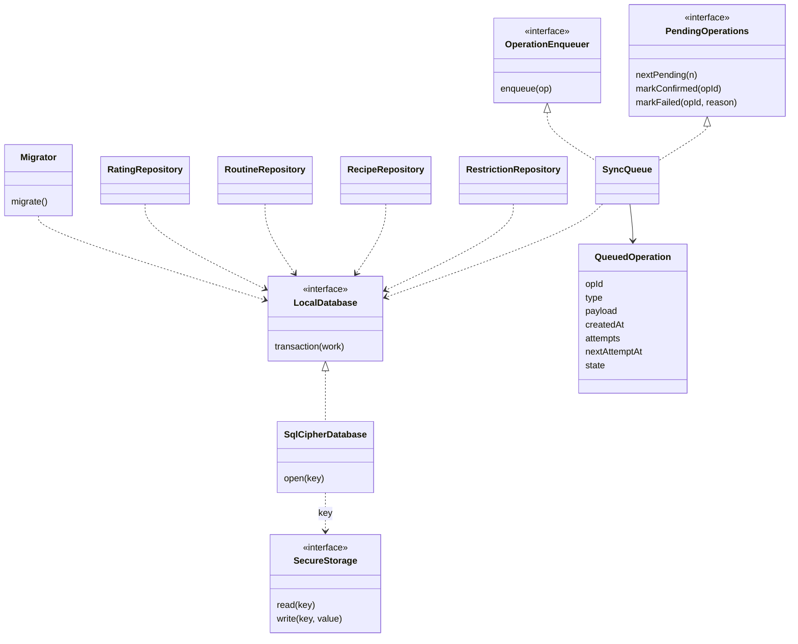

- `state` da operação: `pending`, `confirmed` ou `failed`. Erro de rede nunca vira `failed`; só rejeição de validação vira (ADR-008, item 10). A operação com falha só pode ser descartada pelo usuário (sem reenvio na v1).
- Limites: 500 operações pendentes e 90 dias de idade. Espera progressiva de 5 s, 30 s, 2 min, 10 min e 1 h (teto).
- A restrição entra na fila cifrada pelo SQLCipher. Nenhum log leva a carga.
- As features usam repositórios, não SQL. Só os repositórios conhecem as tabelas (regras A2 e A3). A instância única de `LocalDatabase` nasce na raiz de composição do app (regra A8).

## 10. App: rede e sincronização

Rastreio: UC05, UC08, UC10; ADR-003, ADR-007, ADR-008, ADR-012.

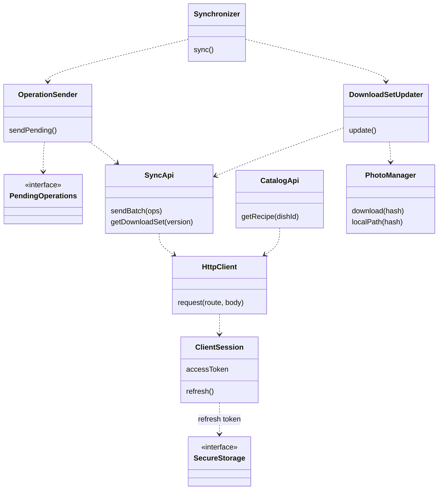

- O `Synchronizer` roda ao abrir o app, ao reconectar e após salvar uma operação (chamada direta, sem Observer). Não há sincronização com o app fechado (ADR-008, item 8).
- O `HttpClient` é genérico. Cada assunto tem seu cliente (`SyncApi`, `CatalogApi`, e os de sugestão e perfil), que crescem sem mexer no núcleo.
- Erro 401 dispara uma renovação; falha de renovação mantém o app usável offline.
- A espera progressiva fica em `OperationSender`, único usuário.

## 11. App: features

### 11.1 Receita e Preparo

Rastreio: UC04, UC09; RN02, RN08, RN15, RN16, RN17, RN22; ADR-001, ADR-012, ADR-014; P02e.

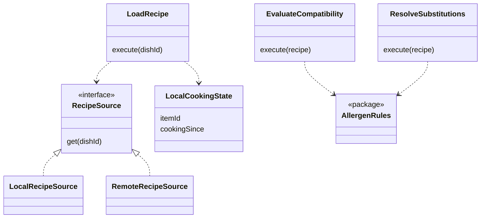

A receita de candidata só é gravada no aparelho ao abrir o passo a passo. "Em preparo" é só marca local, apagada quando a avaliação é salva.

### 11.2 Avaliação e Coleção, Perfil e Restrições, Lembretes

Rastreio: UC07, UC08, UC10, UC11, UC13; RN01 a RN05, RN09, RN13; ADR-006, ADR-008, ADR-009; P02d, P04.

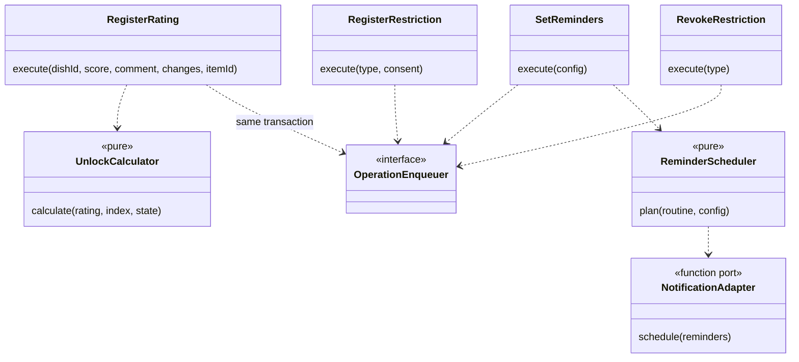

- Perfil e Restrições tem um caso de uso por assunto: restrição, revogação, preferências, lembretes, e-mail e exclusão de conta.
- `UnlockCalculator` é pura e testável sem banco nem rede. Os cinco tipos de marco da RN03 são tratados por `switch` sobre união discriminada, com checagem `never` (R03). Os vetores de teste são comuns com `UnlockRules` do servidor.
- Salvar avaliação, desbloqueios locais e a operação da fila ocorre numa única transação (Outbox, P04).
- `NotificationAdapter` é uma função injetada (P02d), não uma hierarquia de classes.

## 12. Matriz classe × componente × UC

| Classe de projeto | Componente (C4) | UC | RN, RNF ou ADR |
|---|---|---|---|
| `User`, `RestrictionType`, `UserRestriction` | Perfil e Restrições (API e App) | UC07 (config), UC08 | RN08, RN09, RNF06, ADR-006 |
| `Account`, `RefreshSession`, `TokenIssuer` | Identidade e Sessões | UC12 (papel curador) | RNF02, ADR-007 |
| `Dish`, `Recipe`, `Cuisine`, `Ingredient`, `Utensil`, `DishPhoto` | Catálogo | UC04, UC12 | RN17, RN18, RN21, ADR-012 |
| `IngredientSubstitution` | Catálogo | UC09 | RN15, RN22 |
| `Suggestion` | Rotina e Planejamento | UC01, UC02 | RN11 |
| `RoutinePlan`, `RoutineItem`, `ShoppingList`, `ShoppingItem` | Rotina e Planejamento; Rotina e Lista de Compras (App) | UC05, UC06 | RN12, RN14 |
| `Rating`, `BadgeAward`, `EvolutionUnlock`, `BadgeDefinition`, `UnlockRules` | Progresso e Avaliação; Avaliação e Coleção (App) | UC10, UC11, UC13 | RN01 a RN07 |
| `SyncService`, `DownloadSetBuilder`, `ProcessedOperation`, `OperationApplier` | Sincronização | UC05, UC08, UC10 | ADR-008 |
| `SuggestionSearch` | Sugestão e Busca | UC01, UC03 | RN08, RN10, A01 |
| `AllergenRules`, `CatalogInvariants` | Pacote de Alérgenos | UC01, UC04, UC08, UC09 | RN08, RN16, RN22, ADR-014 |
| `FieldCipher`, `KeyProvider` | Cifra de Campos Sensíveis | UC08 | ADR-006 |
| `ProposalService`, `AssistedImportService`, `ImportAgent`, `AiUsageGuard`, `PublicationGate`, `PhotoProcessor` | Importação | UC12 | RN15, RN21, ADR-010, ADR-011 |
| `SqlCipherDatabase`, `Migrator`, repositórios | Acesso ao Banco Local | UC04, UC10 | ADR-005, ADR-006 |
| `SyncQueue`, `QueuedOperation` | Fila de Sincronização | UC05, UC08, UC10 | ADR-005, ADR-008 |
| `Synchronizer`, `OperationSender`, `DownloadSetUpdater` | Sincronizador | UC10 | ADR-001, ADR-008 |
| `HttpClient`, `*Api`, `ClientSession` | Cliente de Rede e Sessão | RNF02 | ADR-003, ADR-007 |
| `PhotoManager` | Gerenciador de Fotos | UC04 | ADR-012 |
| `LoadRecipe`, `EvaluateCompatibility`, `ResolveSubstitutions` | Receita e Preparo | UC04, UC09 | RN15, RN16, RN22 |
| `RegisterRating`, `UnlockCalculator` | Avaliação e Coleção | UC10, UC11, UC13 | RN01 a RN04 |
| `ReminderScheduler`, `NotificationAdapter` | Lembretes | UC07 | RN13, ADR-009 |
| `TechnicalLog` (transversal) | Registro Técnico | A13 | ADR-008, ADR-014 |

Cobertura: as 13 classes do modelo conceitual têm representante. Todos os UC do núcleo (UC01 a UC13) aparecem em ao menos um componente.

## 13. Conferência de SOLID por componente

### 13.1 Ajustes aplicados (12)

| # | Componente | Princípio | Problema | Ajuste aplicado |
|---|---|---|---|---|
| 1 | Receita e Preparo (App) | S | Um só `AbrirReceita` com cinco motivos de mudança | `LoadRecipe`, `EvaluateCompatibility`, `ResolveSubstitutions` |
| 2 | Receita e Preparo (App) | O, D | Escolha local ou remota por `if` | `RecipeSource` com `LocalRecipeSource` e `RemoteRecipeSource` (P02e) |
| 3 | Acesso ao Banco Local | I, D | Features chamavam o banco direto; `migrar()` junto de `transacao()` | Repositórios por feature (P03), `Migrator` separado |
| 4 | Fila de Sincronização | I | Features recebiam a interface de leitura e escrita | `OperationEnqueuer` e `PendingOperations` |
| 5 | Sincronizador | S | Enviava a fila e atualizava o conjunto e as fotos | `OperationSender` e `DownloadSetUpdater` |
| 6 | Cliente de Rede e Sessão | I | `ClienteRede` crescia a cada rota | `HttpClient` genérico mais clientes por assunto |
| 7 | Perfil e Restrições (App) | S | Um ponto de entrada para cinco assuntos | Um caso de uso por assunto |
| 8 | Identidade e Sessões | S | Contas e sessões no mesmo serviço | `AccountService`, `SessionService`, `AccountDeletionService` |
| 9 | Sincronização (API) | S | Escrita (lote) e leitura (conjunto) juntas | `SyncService` e `DownloadSetBuilder` |
| 10 | Catálogo e Perfil (API) | I | Interfaces largas | `CatalogRead` e `CatalogWrite`; `ProfileLifecycle`, `ProfileQuery` e `RestrictionsForFilter` (P06) |
| 11 | Importação | S | Um serviço para manual, assistido, edição, foto e aprovação | `ProposalService` e `AssistedImportService` |
| 12 | Cifra de Campos Sensíveis | D | Chave de arquivo na demo e do Secret Manager no alvo | `KeyProvider` (P02c) |

### 13.2 Passaram sem ajuste

Pacote de Alérgenos (com `CatalogInvariants` em ponto de entrada separado), Lembretes, Avaliação e Coleção, Gerenciador de Fotos, Despensa, Sugestões (App), Rotina e Planejamento, Progresso e Avaliação, Registro Técnico.

### 13.3 Condições e pontos para a 2.7 (fechados)

- **L, provedor de IA:** `KimiProvider` e `RecordedProvider` passam a mesma suíte de contrato (mantido, P02b).
- **O, portão de publicação:** decidido na 2.7 como função com verificações privadas, sem interface de regra (R02). Reavaliar acima de seis regras.
- **O, calculadora de badges:** decidido na 2.7 como `switch` com checagem `never` (R03). Reavaliar se surgir um sexto tipo.
- **Dono do ciclo da sugestão:** o módulo Rotina e Planejamento, conforme o C4. As rotas `aprovar` e `descartar` ficam no grupo "Sugestão e busca" do OpenAPI.
- Nenhum ADR nem o C4 foi contradito. Não há ADR a marcar como "Substituído". O ADR-002 recebe nota sobre `src/shared/`; o ADR-015 registra o idioma.

## 14. Pontos em aberto e hipóteses

- Valores de tokens, limites da fila e espera progressiva são hipóteses a medir no protótipo (ADR-007, ADR-008).
- A lista dos 18 itens da RDC foi lida na RDC 26/2015. A consolidação pela RDC 727/2022 vem de fonte secundária; a lista vigente precisa ser conferida (R10).
- `reminderFrequency`: valores a definir na implementação (a Fase 1 não fixa o conjunto).
- Verificação das fronteiras entre módulos: **fechada na 2.7** (`padroes-de-projeto.md`, seção 6).
- Política de limpeza do armazenamento local de fotos preparadas: em aberto (ADR-012).
- Tradução dos nomes de atributo e método: a aprovar (glossário, seção 9).

## 15. Mapeamento v1.0 → v1.1 (mudanças de estrutura)

| Mudança | Antes (v1.0) | Depois (v1.1) |
|---|---|---|
| Contexto transacional | Sem parâmetro | `tx: Tx` nas interfaces que escrevem (T01) |
| Contrato de aplicador | Dentro da Sincronização | `src/shared/` |
| Portão de publicação | Classe `PortaoPublicacao` | Função `PublicationGate` |
| Desbloqueio no servidor | Embutido no aplicador | `UnlockRules` pura no módulo `progress` |
| Idioma | Português | Inglês nos identificadores (ADR-015) |
| Rotas e campos | `fluxoManualDisponivel`, `chave-reutilizada`, `X-Pacote-Alergenos-Versao` | `manualFlowAvailable`, `key-reused`, `X-Allergen-Package-Version` |
