# Diagrama de classes de projeto — Panelada (Fase 2.6)

> Fase 2.6 — Classes, sequências e contratos. Papel da IA: arquiteto, designer de componentes e de padrões (SOLID).
> Destino: `/docs/fase2/diagrama-classes.md`. Versão 1.0 — 07/10/2026 — status: a revisar pela dupla.
> Insumos: `c4-contexto.md` v1.1, `c4-containers.md` v1.1, `c4-componentes.md` v1.1, ADR-001 a ADR-014, `modelo-conceitual.md`, `casos-de-uso.md`, `regras-de-negocio.md`, `atributos-qualidade.md` v1.3, `propostas-arquiteturais.md` v1.2.
> Escopo: classes de projeto do **Pacote de Alérgenos**, da **API Panelada** e do **App Móvel Panelada**, rastreadas às 13 classes do modelo conceitual. Os nomes dos componentes seguem o `c4-componentes.md`.

## 0. Como ler

- Diagramas Mermaid `classDiagram`, no máximo cerca de 12 elementos cada, divididos por assunto (lição da 2.5).
- `<<interface>>` é a fronteira que outros componentes usam. Uma seta tracejada (`..>`) é dependência de uso. Uma seta cheia (`-->`) é associação de dados.
- Atributos e métodos mostram só o que importa ao contrato. Tipos TypeScript detalhados ficam na implementação.
- Os 12 ajustes da conferência de SOLID (seção 13) já estão aplicados nos diagramas.

## 1. Rastreio ao modelo conceitual

| Conceito (Fase 1) | Classe de projeto | Onde | Observação |
|---|---|---|---|
| Usuario | `Usuario` | API (Perfil e Restrições); App (cópia local) | A conta de acesso é `Conta` (Identidade e Sessões), com a mesma chave primária. |
| RestricaoAlimentar | `TipoRestricao` e `RestricaoDoUsuario` | API; App | O tipo é catálogo fixo por seed. A escolha do usuário é cifrada no servidor e na fila. A revogação apaga a linha. |
| Utensilio | `Utensilio` | API (Catálogo); App | |
| Ingrediente | `Ingrediente` | API (Catálogo); App | Ganha `alergenos` (19 códigos) e `semLactose`. |
| Culinaria | `Culinaria` | API (Catálogo); App (índice leve) | |
| Prato | `Prato` | API (Catálogo); App (índice leve) | Prato aprovado nunca é apagado, só desativado. |
| Receita | `Receita` | API (Catálogo); App (conjunto baixado) | Ganha `estadoAlergenos` e `alergenosAtualizadoEm`. |
| Sugestao | `Sugestao` | API (Rotina e Planejamento) | O módulo Rotina é dono do ciclo `apresentada`, `candidata`, `descartada`. |
| PlanoDeRotina | `PlanoDeRotina` | API (Rotina e Planejamento); App | |
| ItemDeRotina | `ItemDeRotina` | API; App | Servidor só conhece `planejado` e `concluido`. "Em preparo" é local (`EstadoPreparoLocal`). |
| ListaDeCompras | `ListaDeCompras` e `ItemDeCompra` | API; App | `ItemDeCompra` promove a associação com `comprado`. |
| Avaliacao | `Avaliacao` | API (Progresso e Avaliação); App | O `id` é o `opId` gerado no cliente. |
| Badge | `DefinicaoBadge` e `ConquistaBadge` | API; App (índice leve) | A conquista promove a associação com `dataDesbloqueio`. |

Classes de projeto sem equivalente conceitual: `SubstituicaoIngrediente` (promove a autoassociação de Ingrediente), `DesbloqueioEvolucao` (confirmação do servidor, RN02 e RN04), `Conta` e `SessaoRefresh` (RNF02, ADR-007), `OperacaoFila` e `OperacaoProcessada` (ADR-008) e as classes técnicas dos componentes.

## 2. Pacote de Alérgenos (compartilhado)

Rastreio: UC01, UC04, UC08, UC09; RN08, RN10, RN16, RN22; ADR-014; A06.

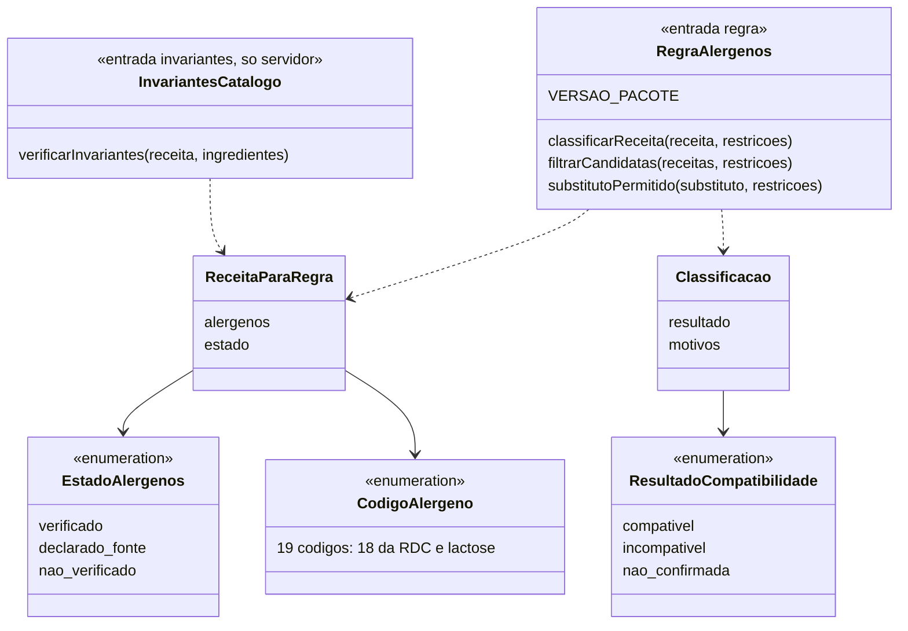

- As funções são puras: sem banco, rede, disco nem log (ADR-014, itens 2, 6 e 9).
- Receita sem restrição cadastrada classifica como `compativel`; o estado dos alérgenos continua visível (RN16). Com restrição, vale a RN08 completa. "Declarado pela fonte" é `compativel` quando não há alérgeno da restrição, sempre com o aviso "compatibilidade não confirmada".
- `InvariantesCatalogo` é um ponto de entrada separado, para o app não carregar o que só o servidor usa. Invariantes: estado de alérgenos presente; `verificado` com lista vazia só com `confirmadoSemAlergenos`; união dos alérgenos dos ingredientes igual à da receita; substituto sem alérgenos nunca `verificado`; ingrediente com `leite` e sem `lactose` só com `semLactose = true`.
- A versão do pacote é exposta por cliente e servidor. O app envia a versão no cabeçalho `X-Pacote-Alergenos-Versao`, e a API responde `pacoteVersaoMinima`. O app avisa e não bloqueia.

## 3. API: fronteiras entre módulos

Rastreio: ADR-002 (regra de fronteira); `c4-componentes.md` 2.1. Cada módulo só é acessado pelas interfaces abaixo.

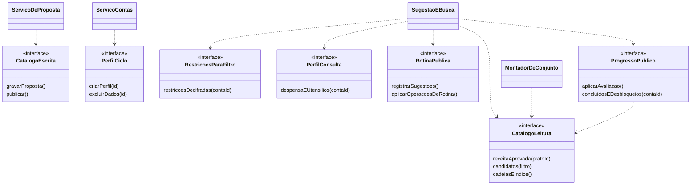

- Só `SugestaoEBusca` recebe a restrição decifrada (`RestricoesParaFiltro`). Nenhum outro consumidor consegue pedi-la.
- `ServicoDeProposta` é o único consumidor de `CatalogoEscrita` (UC12).
- Quem implementa `aprovar` e `descartar` de sugestão é `RotinaPublica`. As rotas aparecem no grupo "Sugestão e busca" do OpenAPI por afinidade de uso.

## 4. API: Catálogo

Rastreio: UC04, UC09, UC12; RN15, RN17, RN18, RN21, RN22; ADR-010, ADR-012, ADR-014.

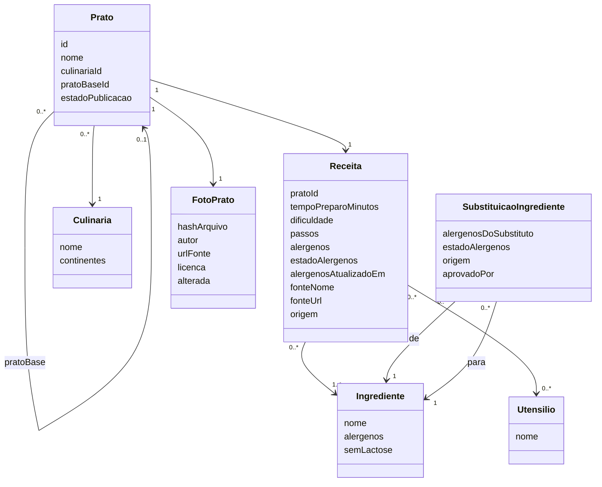

`estadoPublicacao` assume `proposto`, `aprovado` ou `desativado`. Só `aprovado` chega ao usuário. A proposta de IA, com saída bruta, modelo e tokens, fica no módulo Importação (seção 8).

## 5. API: usuário, rotina e progresso

Rastreio: UC01 a UC03, UC05, UC06, UC08, UC10, UC11, UC13; RN01 a RN07, RN09, RN11, RN12, RN14.

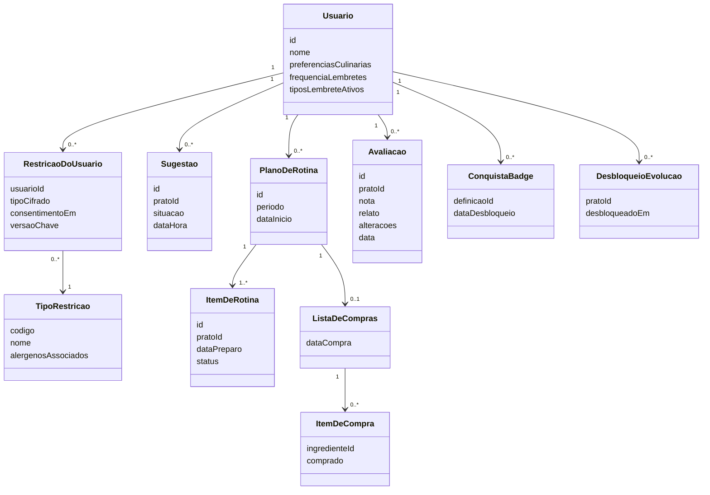

- `nota` é um inteiro de 0 a 10, em meios-pontos (RN05).
- `ItemDeRotina.status` no servidor só assume `planejado` ou `concluido`. O `id` do item é o `opId` da operação que o cria. Cada operação seguinte tem `opId` próprio.
- Avaliações, conquistas e desbloqueios só se acrescentam (RN04, RN06, RNF09). Não há edição nem exclusão de avaliação, exceto na exclusão de conta.
- `tipoCifrado` usa AES-256-GCM, com versão da chave e a conta como dado autenticado (ADR-006). A revogação apaga a linha.
- `DefinicaoBadge` guarda o `marco` tipado (`prato`, `culinaria`, `n_culinarias`, `todos_continentes`, `conjunto`), carregado por seed.

## 6. API: Identidade e Sessões

Rastreio: RNF02; US09 (exclusão de conta); UC12 (papel curador); ADR-007, ADR-008.

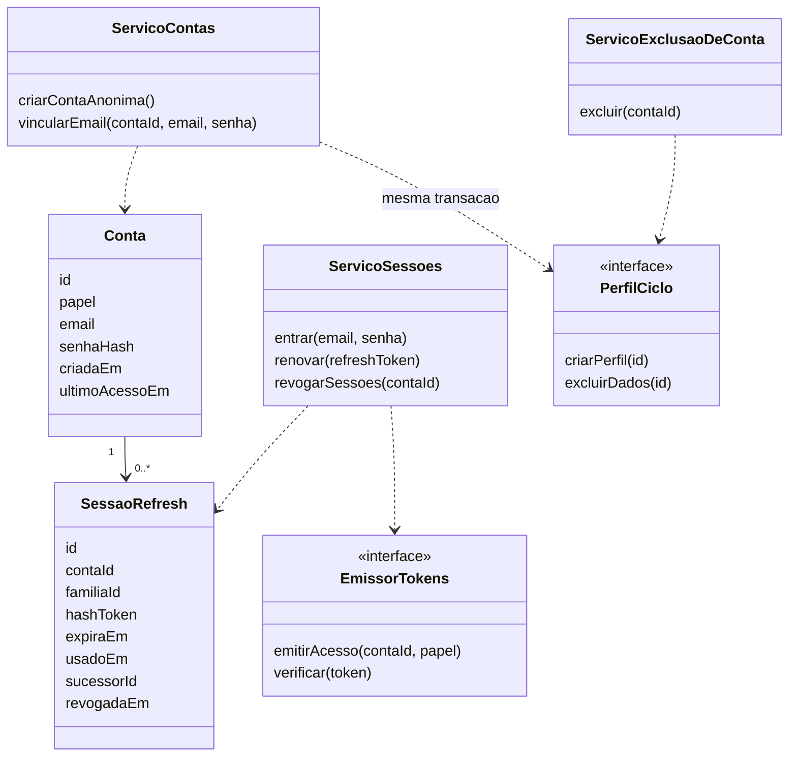

- O JWT de acesso dura 45 minutos e carrega só `contaId` e papel. O refresh dura 30 dias, é opaco, de uso único e guardado com hash.
- Reenvio do mesmo refresh dentro de 60 s do primeiro uso devolve o mesmo par (via `sucessorId`). Reuso fora da janela revoga a `familiaId` inteira.
- Conta anônima sem sincronização por 12 meses é excluída com seus dados. Quem vinculou e-mail não é excluído por inatividade.
- `ServicoExclusaoDeConta` chama a interface de exclusão de cada módulo e remove as `OperacaoProcessada` da conta. Um comando de auditoria verifica que toda conta com papel `usuario` tem exatamente um perfil.

## 7. API: Sincronização

Rastreio: UC05, UC08, UC10; ADR-008; decisões da 2.6 sobre idempotência.

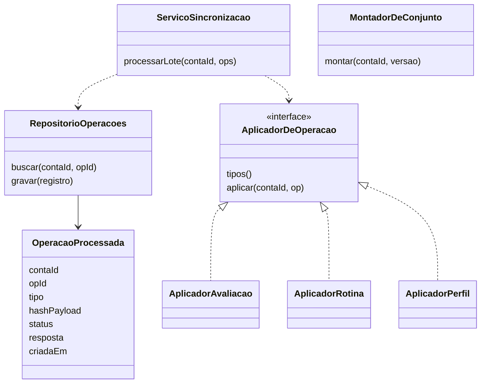

- Chave de idempotência: `(contaId, opId)`. Mesmo `opId` e mesmo `hashPayload` devolvem a resposta gravada com `repetida = true`. Mesmo `opId` com hash diferente é recusado (422, `chave-reutilizada`). Validade de 90 dias.
- O aplicador e o registro em `OperacaoProcessada` ficam na **mesma transação**.
- O serviço falha na inicialização se dois aplicadores declararem o mesmo tipo, ou se um tipo da lista de oito não tiver aplicador. Os tipos: `avaliacao.registrar`, `item.reagendar`, `item.remover`, `lista.definir_data_compra`, `lista.marcar_item`, `restricao.cadastrar`, `restricao.revogar`, `lembretes.definir`.
- O servidor recalcula os desbloqueios e só acrescenta. Nunca revoga (RN04).

## 8. API: Importação e Cifra

Rastreio: UC12 (FA2); US10, US18; RN15, RN17, RN21, RN22; ADR-006, ADR-010, ADR-011, ADR-012, ADR-013.

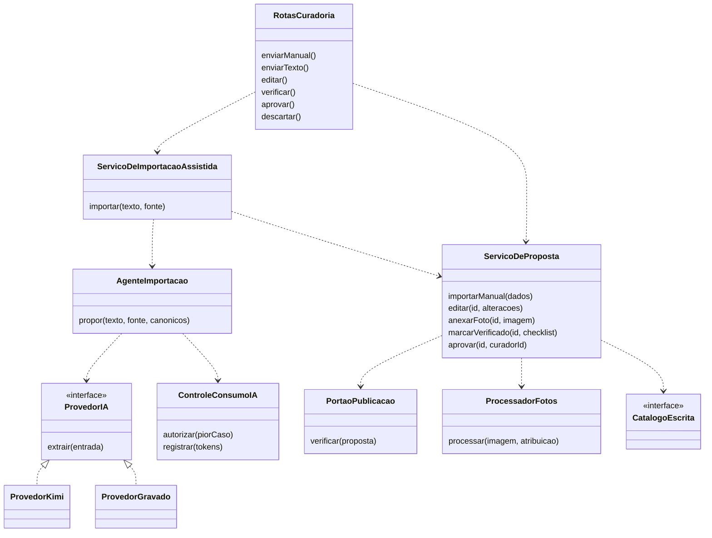

- **Cifra de Campos Sensíveis** (componente de apoio, no módulo Perfil): `Cifra` recebe a chave por uma interface `ProvedorDeChave`, com `ChaveEmArquivo` (demo) e `ChaveSecretManager` (alvo). A chave de IA fica em segredo separado.
- O servidor atribui `nao_verificado` a todo alérgeno proposto, preenche fonte e link a partir do curador e descarta ids canônicos inexistentes e códigos fora do vocabulário (ADR-011, item 4).
- O `PortaoPublicacao` chama `InvariantesCatalogo.verificarInvariantes` e bloqueia por campo da A09, fonte (RN17), foto sem os quatro elementos de atribuição ou invariante violada. Aprovar não exige `verificado`.
- Os dois adaptadores de `ProvedorIA` passam a mesma suíte de contrato (mesmo esquema de saída, mesmos erros, mesmo registro de tokens). O gravado só é selecionado por `PROVEDOR_IA=gravado` e marca `modelo = "gravado"`.
- Falha do provedor ou saída inválida após uma tentativa de correção não grava proposta. Os tokens consumidos são registrados.

## 9. App: dados locais e fila

Rastreio: UC04, UC05, UC08, UC10; A04, A05, A08; ADR-005, ADR-006, ADR-008.

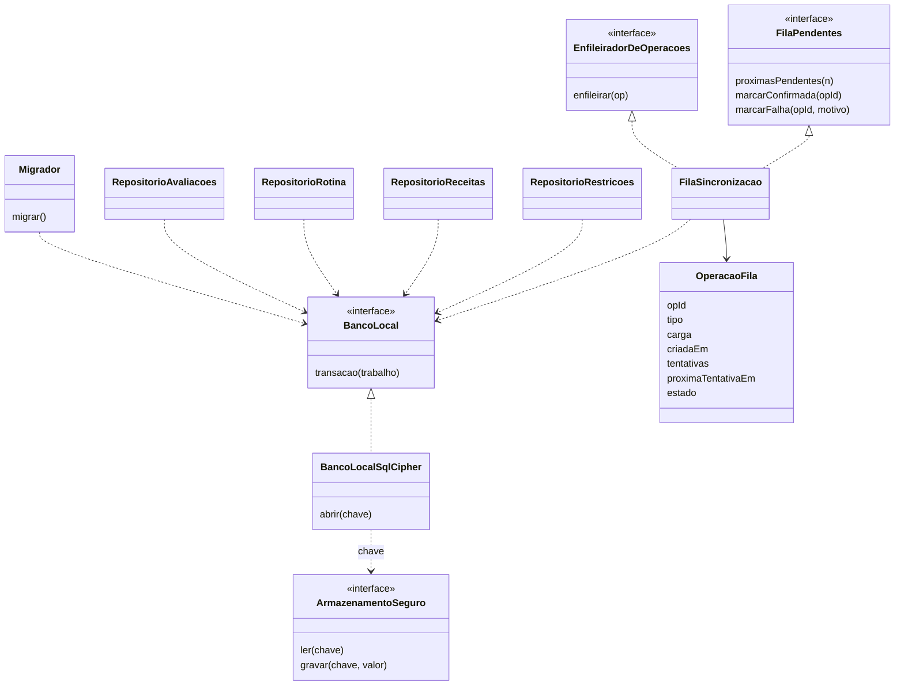

- `estado` da operação: `pendente`, `confirmada` ou `falha`. Erro de rede nunca vira `falha`; só rejeição de validação vira (ADR-008, item 10). A operação com falha só pode ser descartada pelo usuário (sem reenvio na v1).
- Limites: 500 operações pendentes e 90 dias de idade. Espera progressiva de 5 s, 30 s, 2 min, 10 min e 1 h (teto).
- A restrição entra na fila cifrada pelo SQLCipher. Nenhum log leva a carga.
- As features usam repositórios, não SQL. Só os repositórios conhecem as tabelas.

## 10. App: rede e sincronização

Rastreio: UC05, UC08, UC10; ADR-003, ADR-007, ADR-008, ADR-012.

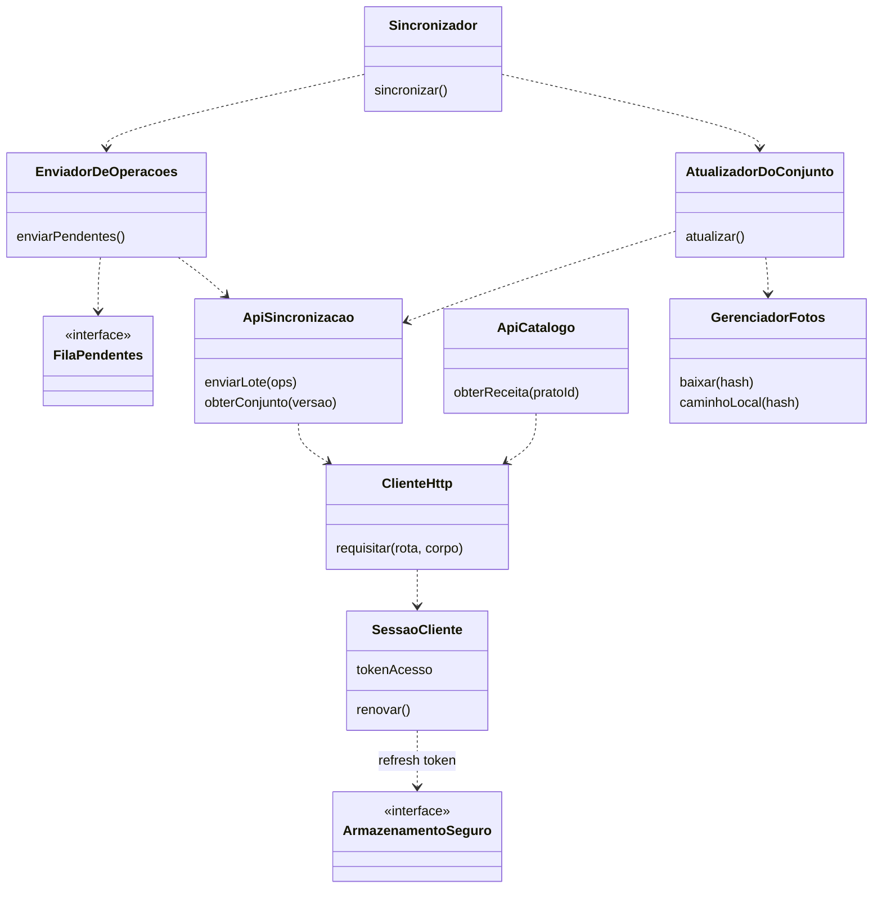

- O `Sincronizador` roda ao abrir o app, ao reconectar e após salvar uma operação. Não há sincronização com o app fechado (ADR-008, item 8).
- O `ClienteHttp` é genérico. Cada assunto tem seu cliente (`ApiSincronizacao`, `ApiCatalogo`, e os de sugestão e perfil), que crescem sem mexer no núcleo.
- Erro 401 dispara uma renovação; falha de renovação mantém o app usável offline.

## 11. App: features

### 11.1 Receita e Preparo

Rastreio: UC04, UC09; RN02, RN08, RN15, RN16, RN17, RN22; ADR-001, ADR-012, ADR-014.

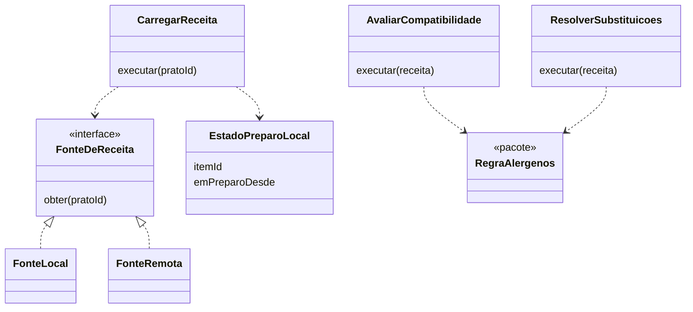

A receita de candidata só é gravada no aparelho ao abrir o passo a passo. "Em preparo" é só marca local, apagada quando a avaliação é salva.

### 11.2 Avaliação e Coleção, Perfil e Restrições, Lembretes

Rastreio: UC07, UC08, UC10, UC11, UC13; RN01 a RN05, RN09, RN13; ADR-006, ADR-008, ADR-009.

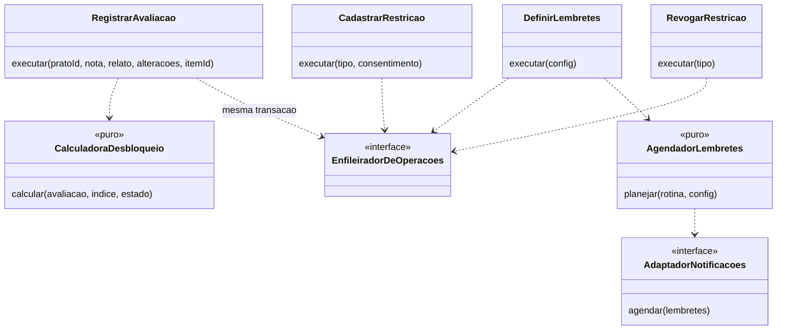

- Perfil e Restrições tem um caso de uso por assunto: restrição, revogação, preferências, lembretes, e-mail e exclusão de conta.
- `CalculadoraDesbloqueio` é pura e testável sem banco nem rede. Os cinco tipos de marco da RN03 são tratados por `switch`.
- Salvar avaliação, desbloqueios locais e a operação da fila ocorre numa única transação.

## 12. Matriz classe × componente × UC

| Classe de projeto | Componente (C4) | UC | RN, RNF ou ADR |
|---|---|---|---|
| `Usuario`, `TipoRestricao`, `RestricaoDoUsuario` | Perfil e Restrições (API e App) | UC07 (config), UC08 | RN08, RN09, RNF06, ADR-006 |
| `Conta`, `SessaoRefresh`, `EmissorTokens` | Identidade e Sessões | UC12 (papel curador) | RNF02, ADR-007 |
| `Prato`, `Receita`, `Culinaria`, `Ingrediente`, `Utensilio`, `FotoPrato` | Catálogo | UC04, UC12 | RN17, RN18, RN21, ADR-012 |
| `SubstituicaoIngrediente` | Catálogo | UC09 | RN15, RN22 |
| `Sugestao` | Rotina e Planejamento | UC01, UC02 | RN11 |
| `PlanoDeRotina`, `ItemDeRotina`, `ListaDeCompras`, `ItemDeCompra` | Rotina e Planejamento; Rotina e Lista de Compras (App) | UC05, UC06 | RN12, RN14 |
| `Avaliacao`, `ConquistaBadge`, `DesbloqueioEvolucao`, `DefinicaoBadge` | Progresso e Avaliação; Avaliação e Coleção (App) | UC10, UC11, UC13 | RN01 a RN07 |
| `ServicoSincronizacao`, `MontadorDeConjunto`, `OperacaoProcessada`, `AplicadorDeOperacao` | Sincronização | UC05, UC08, UC10 | ADR-008 |
| `SugestaoEBusca` | Sugestão e Busca | UC01, UC03 | RN08, RN10, A01 |
| `RegraAlergenos`, `InvariantesCatalogo` | Pacote de Alérgenos | UC01, UC04, UC08, UC09 | RN08, RN16, RN22, ADR-014 |
| `Cifra`, `ProvedorDeChave` | Cifra de Campos Sensíveis | UC08 | ADR-006 |
| `ServicoDeProposta`, `ServicoDeImportacaoAssistida`, `AgenteImportacao`, `ControleConsumoIA`, `PortaoPublicacao`, `ProcessadorFotos` | Importação | UC12 | RN15, RN21, ADR-010, ADR-011 |
| `BancoLocalSqlCipher`, `Migrador`, repositórios | Acesso ao Banco Local | UC04, UC10 | ADR-005, ADR-006 |
| `FilaSincronizacao`, `OperacaoFila` | Fila de Sincronização | UC05, UC08, UC10 | ADR-005, ADR-008 |
| `Sincronizador`, `EnviadorDeOperacoes`, `AtualizadorDoConjunto` | Sincronizador | UC10 | ADR-001, ADR-008 |
| `ClienteHttp`, `Api*`, `SessaoCliente` | Cliente de Rede e Sessão | RNF02 | ADR-003, ADR-007 |
| `GerenciadorFotos` | Gerenciador de Fotos | UC04 | ADR-012 |
| `CarregarReceita`, `AvaliarCompatibilidade`, `ResolverSubstituicoes` | Receita e Preparo | UC04, UC09 | RN15, RN16, RN22 |
| `RegistrarAvaliacao`, `CalculadoraDesbloqueio` | Avaliação e Coleção | UC10, UC11, UC13 | RN01 a RN04 |
| `AgendadorLembretes`, `AdaptadorNotificacoes` | Lembretes | UC07 | RN13, ADR-009 |
| `RegistroTecnico` (transversal) | Registro Técnico | A13 | ADR-008, ADR-014 |

Cobertura: as 13 classes do modelo conceitual têm representante. Todos os UC do núcleo (UC01 a UC13) aparecem em ao menos um componente.

## 13. Conferência de SOLID por componente

### 13.1 Ajustes aplicados (12)

| # | Componente | Princípio | Problema | Ajuste aplicado |
|---|---|---|---|---|
| 1 | Receita e Preparo (App) | S | Um só `AbrirReceita` com cinco motivos de mudança | `CarregarReceita`, `AvaliarCompatibilidade`, `ResolverSubstituicoes` |
| 2 | Receita e Preparo (App) | O, D | Escolha local ou remota por `if` | `FonteDeReceita` com `FonteLocal` e `FonteRemota` |
| 3 | Acesso ao Banco Local | I, D | Features chamavam o banco direto; `migrar()` junto de `transacao()` | Repositórios por feature, `Migrador` separado |
| 4 | Fila de Sincronização | I | Features recebiam a interface de leitura e escrita | `EnfileiradorDeOperacoes` e `FilaPendentes` |
| 5 | Sincronizador | S | Enviava a fila e atualizava o conjunto e as fotos | `EnviadorDeOperacoes` e `AtualizadorDoConjunto` |
| 6 | Cliente de Rede e Sessão | I | `ClienteRede` crescia a cada rota | `ClienteHttp` genérico mais clientes por assunto |
| 7 | Perfil e Restrições (App) | S | Um ponto de entrada para cinco assuntos | Um caso de uso por assunto |
| 8 | Identidade e Sessões | S | Contas e sessões no mesmo serviço | `ServicoContas`, `ServicoSessoes`, `ServicoExclusaoDeConta` |
| 9 | Sincronização (API) | S | Escrita (lote) e leitura (conjunto) juntas | `ServicoSincronizacao` e `MontadorDeConjunto` |
| 10 | Catálogo e Perfil (API) | I | Interfaces largas | `CatalogoLeitura` e `CatalogoEscrita`; `PerfilCiclo`, `PerfilConsulta` e `RestricoesParaFiltro` |
| 11 | Importação | S | Um serviço para manual, assistido, edição, foto e aprovação | `ServicoDeProposta` e `ServicoDeImportacaoAssistida` |
| 12 | Cifra de Campos Sensíveis | D | Chave de arquivo na demo e do Secret Manager no alvo | `ProvedorDeChave` |

### 13.2 Passaram sem ajuste

Pacote de Alérgenos (com `InvariantesCatalogo` em ponto de entrada separado), Lembretes, Avaliação e Coleção, Gerenciador de Fotos, Despensa, Sugestões (App), Rotina e Planejamento, Progresso e Avaliação, Registro Técnico.

### 13.3 Condições e pontos para a 2.7

- **L, provedor de IA:** `ProvedorKimi` e `ProvedorGravado` passam a mesma suíte de contrato.
- **O, portão de publicação:** as regras são um bloco; uma lista de regras seria extensível. Decisão de padrão na 2.7.
- **O, calculadora de badges:** `switch` sobre cinco tipos fixos (RN03). Reavaliar na 2.7 se surgir um sexto tipo.
- **Dono do ciclo da sugestão:** o módulo Rotina e Planejamento, conforme o C4. As rotas `aprovar` e `descartar` ficam no grupo "Sugestão e busca" do OpenAPI.
- Nenhum ADR nem o C4 foi contradito. Não há ADR a marcar como "Substituído".

## 14. Pontos em aberto e hipóteses

- Valores de tokens, limites da fila e espera progressiva são hipóteses a medir no protótipo (ADR-007, ADR-008).
- A lista dos 18 itens da RDC foi lida na RDC 26/2015. A consolidação pela RDC 727/2022 vem de fonte secundária; a lista vigente precisa ser conferida.
- `frequencia` de lembretes: valores a definir na implementação (a Fase 1 não fixa o conjunto).
- Verificação das fronteiras entre módulos: 2.7.
- Política de limpeza do armazenamento local de fotos preparadas: em aberto (ADR-012).
