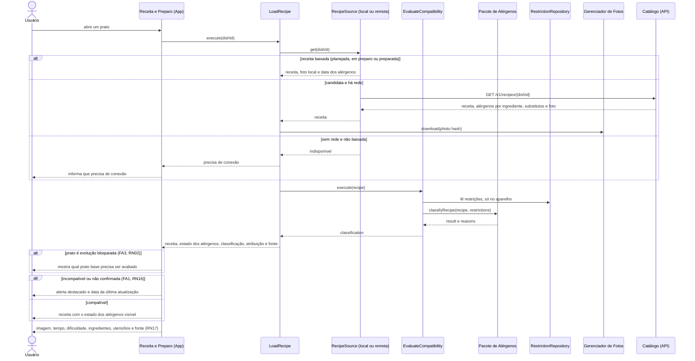
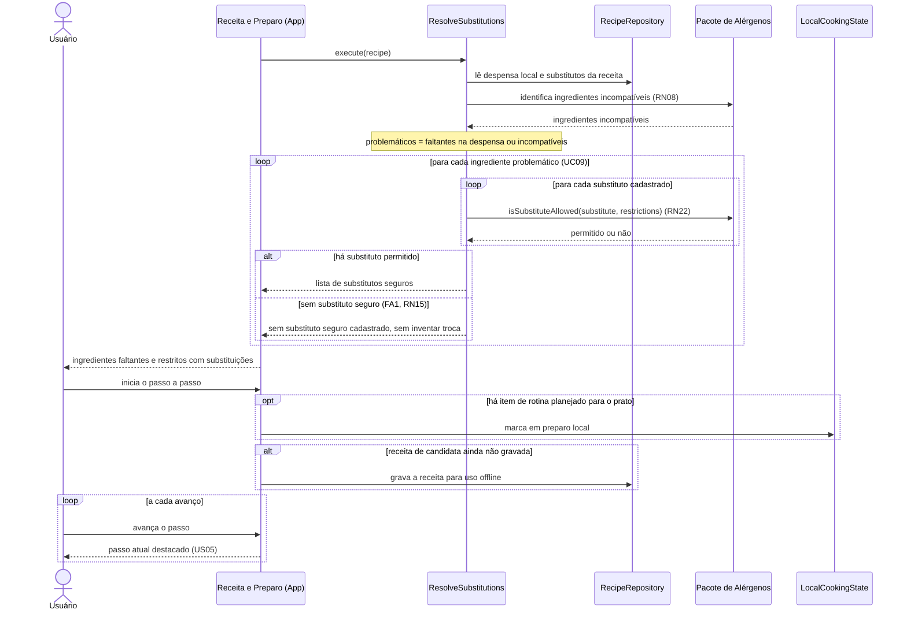

# Sequência — UC04, Visualizar receita (com UC09)

> Fase 2.6 — Classes, sequências e contratos; revisão da 2.7. Papel da IA: arquiteto, designer de componentes e de padrões (SOLID).
> Destino: `/docs/fase2/sequencia-uc04.md`. Versão 1.1 — 07/10/2026 — status: a revisar pela dupla.
> Rastreio: UC04 (fluxo principal, FA1, FA3), UC09; RN02, RN08, RN15, RN16, RN17, RN22; US05, US09, US10, US15; A04, A06; ADR-001, ADR-012, ADR-014, ADR-015.
> Os participantes seguem os componentes do `c4-componentes.md` v1.1 (nomes em português) e as classes do `diagrama-classes.md` v1.1 (identificadores em inglês, ADR-015).
> Alterações da v1.1: identificadores em inglês pelo glossário.

## 1. Abrir a receita

- A classificação roda **no aparelho**, também para candidata. O servidor não recebe a restrição nessa consulta (RNF06, A05). A mesma `AllergenRules` roda nos dois lados, com a mesma suíte de vetores (ADR-014).
- `LoadRecipe` recebe a fonte (`LocalRecipeSource` ou `RemoteRecipeSource`) por injeção, montada na raiz de composição (P02e, regra A8).
- Sem restrição cadastrada, o resultado é `compatible` e o estado dos alérgenos fica visível (RN16). Com restrição, vale a RN08 completa. Estado `source_declared` é `compatible` quando não há alérgeno da restrição, sempre com o aviso "compatibilidade não confirmada".
- Receita sem estado de alérgenos ou com lista vazia, sem confirmação, classifica como `unconfirmed`.
- Sem rede e sem receita baixada, a tela diz isso. A preparada de instalação nova volta quando o usuário abre com rede (R15).
- Medida (H): abrir offline em até 2 s com SQLCipher no emulador de referência (A04).

## 2. Substituições e passo a passo

- Os substitutos chegam com a receita, cada um com seus alérgenos. O filtro da RN22 roda no aparelho. Substituto sem alérgenos declarados fica `unverified` e some para quem tem restrição.
- "Em preparo" é só uma marca local (`LocalCookingState`), sem operação na fila. É apagada quando a avaliação é salva (UC10). Abrir o passo a passo sem item de rotina não marca nada.
- A receita de candidata só é gravada no aparelho **quando o passo a passo abre**. Antes disso a consulta é só leitura.
- Nenhum log, métrica ou erro leva restrição ou resultado ligado a usuário (ADR-014, itens 6 e 9).
