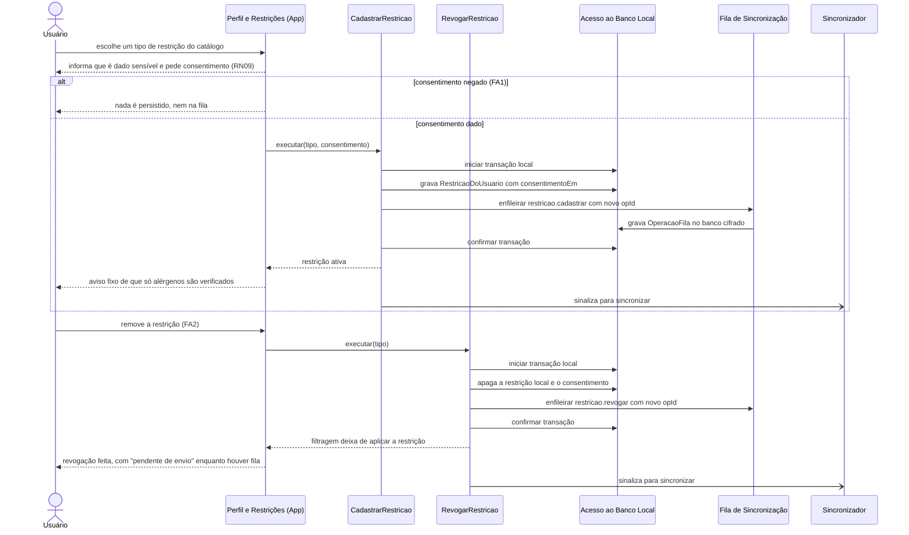
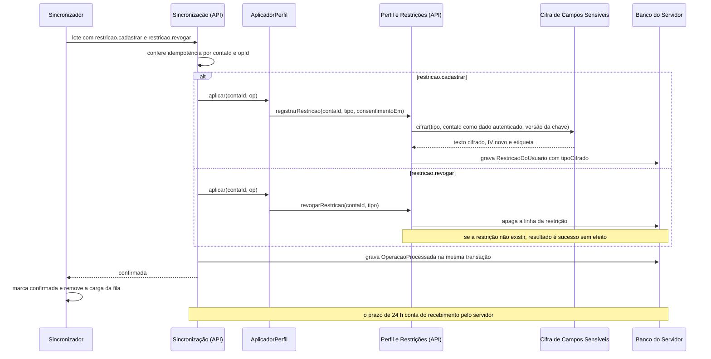

# Sequência — UC08, Cadastrar restrições alimentares

> Fase 2.6 — Classes, sequências e contratos. Papel da IA: arquiteto, designer de componentes e de padrões (SOLID).
> Destino: `/docs/fase2/sequencia-uc08.md`. Versão 1.0 — 07/10/2026 — status: a revisar pela dupla.
> Rastreio: UC08 (fluxo principal, FA1, FA2); RN08, RN09, RN16; US09; RNF06; A05, A08; ADR-005, ADR-006, ADR-008 (item 3).
> Os participantes seguem os componentes do `c4-componentes.md` v1.1 e as classes do `diagrama-classes.md`.

## 1. Cadastrar e revogar no aparelho

- O efeito local é imediato e não depende de rede.
- A restrição entra na fila cifrada pelo SQLCipher; a chave fica em `expo-secure-store` (ADR-005, ADR-006). A carga nunca vai para log.
- Sem consentimento, nada é gravado, nem na fila (RN09).
- Cadastrar e revogar a mesma restrição antes de sincronizar gera duas operações, enviadas em ordem de criação.
- Se um `restricao.cadastrar` for rejeitado permanentemente, a restrição **continua ativa no aparelho** e a operação fica visível como falha (lado seguro, A06).
- O aviso fixo cobre condições não verificadas, como o diabetes (R1).

## 2. Sincronizar e cumprir as 24 h

- Cifra: AES-256-GCM, IV de 12 bytes novo a cada gravação, etiqueta de 16 bytes, versão da chave e a conta como dado adicional autenticado. A chave vem de `ProvedorDeChave`, fora do banco.
- O servidor só decifra em memória, nas rotas de sugestão e busca, por `RestricoesParaFiltro`. Nunca registra a restrição em log.
- A revogação é **idempotente**: apagar o que não existe devolve sucesso.
- Sem sincronização em segundo plano (ADR-008, item 8), o prazo de 24 h vale **a partir do recebimento pelo servidor**. Com o aparelho offline ou o app fechado, a cópia no servidor existe até a próxima abertura com rede. Isso é consequência aceita do ADR-008 e deve constar do texto de consentimento.
- Depois da confirmação, a carga sai da fila. A tabela de idempotência guarda o `hashPayload`, não o conteúdo da restrição.
