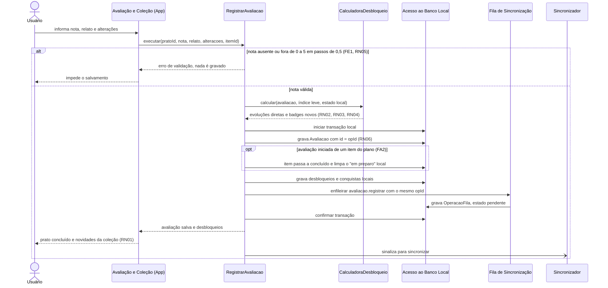
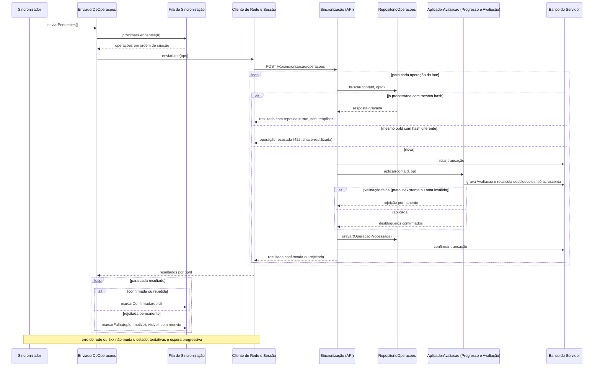

# Sequência — UC10, Registrar avaliação (com UC13 e UC11)

> Fase 2.6 — Classes, sequências e contratos. Papel da IA: arquiteto, designer de componentes e de padrões (SOLID).
> Destino: `/docs/fase2/sequencia-uc10.md`. Versão 1.0 — 07/10/2026 — status: a revisar pela dupla.
> Rastreio: UC10 (fluxo principal, FA1, FA2, FE1), UC13, UC11; RN01 a RN07; US12, US14, US15, US16; A04, A08; ADR-001, ADR-005, ADR-008.
> Os participantes seguem os componentes do `c4-componentes.md` v1.1 e as classes do `diagrama-classes.md`.

## 1. Salvar offline

- A avaliação, os desbloqueios e a operação da fila entram na **mesma transação** local (ADR-005). Se qualquer gravação falhar, nada fica gravado.
- O `opId` é gerado uma vez e é o `id` da `Avaliacao` e da operação.
- Repetir um prato gera novo `opId`, sem sobrescrever avaliações anteriores (FA1, RN06). Evolução já desbloqueada não gera novo desbloqueio (RN02).
- Nada aqui usa rede. Medida (H): salvar e desbloquear em até 1 s (A04).

## 2. Sincronizar

- Erro de rede ou 5xx incrementa as tentativas e reagenda (5 s, 30 s, 2 min, 10 min, 1 h). Ao reconectar, o mesmo `opId` é reenviado e o servidor trata como repetição.
- O aplicador e a gravação de `OperacaoProcessada` ficam na mesma transação do servidor.
- O servidor **recalcula** os desbloqueios pelo `CatalogoLeitura` e só acrescenta. Nunca revoga (RN04).
- Rejeição permanente deixa a operação visível como falha, sem bloquear as demais. O usuário só pode descartá-la (sem reenvio na v1). O desbloqueio local feito antes permanece (RN04). Prato aprovado nunca é apagado, só desativado, o que torna essa rejeição rara.
- Log da falha leva só `opId` e motivo (A13).
- Medidas (H): início da sincronização em até 60 s após a reconexão; 0 avaliações perdidas e 0 duplicadas em 100 ciclos de queda e reenvio (A08).
