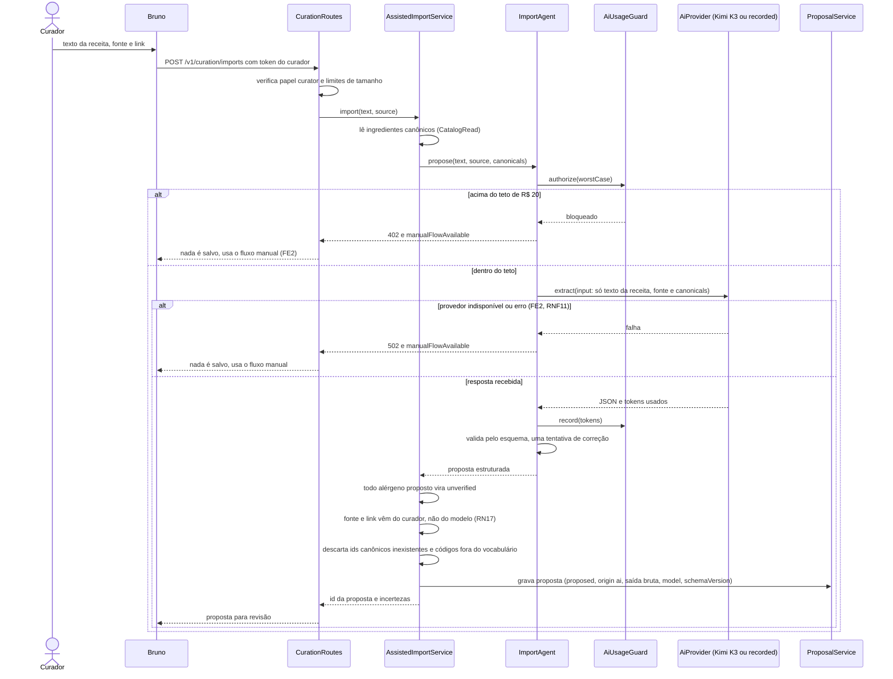
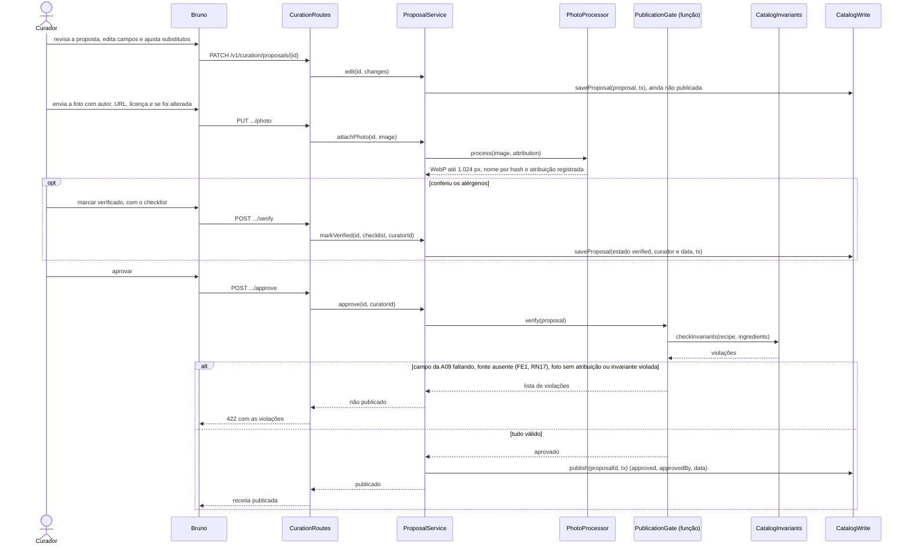

# Sequência — UC12, Importar e manter catálogo (fluxo assistido por IA)

> Fase 2.6 — Classes, sequências e contratos; revisão da 2.7. Papel da IA: arquiteto, designer de componentes e de padrões (SOLID).
> Destino: `/docs/fase2/sequencia-uc12.md`. Versão 1.1 — 07/10/2026 — status: a revisar pela dupla.
> Rastreio: UC12 (FA2, FE1, FE2); RN15, RN17, RN21, RN22; RNF08, RNF11; US10, US18; A06, A09; ADR-007, ADR-010, ADR-011, ADR-012, ADR-013, ADR-014, ADR-015.
> Os participantes seguem os componentes do `c4-componentes.md` v1.1 (nomes em português) e as classes do `diagrama-classes.md` v1.1 (identificadores em inglês, ADR-015).
> Alterações da v1.1: identificadores em inglês pelo glossário, `Tx` nas escritas do catálogo (T01) e `PublicationGate` como função (R02).

## 1. Do texto à proposta

- **Nenhum dado de usuário** vai ao provedor. A entrada tem só o texto da receita, a fonte e a lista de ingredientes canônicos (RNF06, R11).
- O modelo nunca define estado de alérgeno nem fonte. O servidor atribui `unverified` e preenche fonte e link com o que o curador informou.
- O controle de consumo checa o pior caso (`max_tokens`) antes da chamada. Aviso a 80% e bloqueio a 100% do teto. Os tokens são registrados mesmo quando a validação falha.
- O texto colado é conteúdo não confiável: instruções separadas do texto, agente sem ferramentas, saída validada por esquema, limite de 20.000 caracteres (hipótese) e campos tratados como texto simples (ADR-011, item 7).
- No FE2, a Fase 1 diz "notifica o curador e redireciona". Aqui vira resposta de erro com `manualFlowAvailable = true`, porque não há tela. Divergência para o Lote 3 (issue #31, ainda não aberta).
- A importação é síncrona. Se estourar o tempo limite no alvo, o ADR-004 prevê torná-la assíncrona.
- O provedor (`KimiProvider` ou `RecordedProvider`) é escolhido por `PROVEDOR_IA` na raiz de composição (P02b).

## 2. Revisão, verificação e publicação

- Só o curador marca `verified`. O checklist grava: ingredientes conferidos contra os 19 códigos, segunda fonte (recomendada), consistência entre receita e ingredientes, `lactoseFreeChecked` quando aplicável e `confirmedAllergenFree` quando a lista é vazia.
- `PublicationGate` é uma função com uma verificação privada por regra (R02). Ela **bloqueia** por campo faltante da A09, fonte ausente (RN17), foto sem os quatro elementos de atribuição (ADR-012) ou invariante do ADR-014 violada (incluindo ingrediente com `leite` sem `lactose` e sem `lactoseFree`). A resposta lista **todas** as violações.
- Aprovar **não exige** `verified`. Receita `unverified` ou `source_declared` pode ser publicada, mas não aparece nas sugestões de quem tem restrição (RN08). O lançamento exige 100 pratos verificados (A09).
- `ProposalService` abre o `tx` e o passa a `CatalogWrite`; só ele importa essa interface (regra S4).
- Verificar depois da publicação, ou editar receita publicada, atualiza a data dos alérgenos, e a mudança chega aos aparelhos pelo conjunto baixado (ADR-010, item 10; ADR-008, item 9).
- O fluxo manual usa as mesmas rotas, pulando a Parte 1: entra pela rota de receita manual, com o mesmo esquema e o mesmo portão (ADR-010, item 1).
