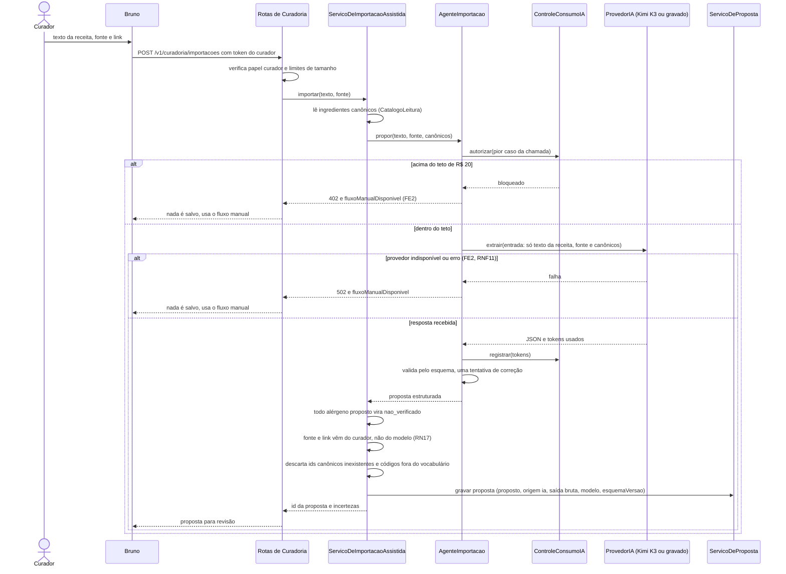
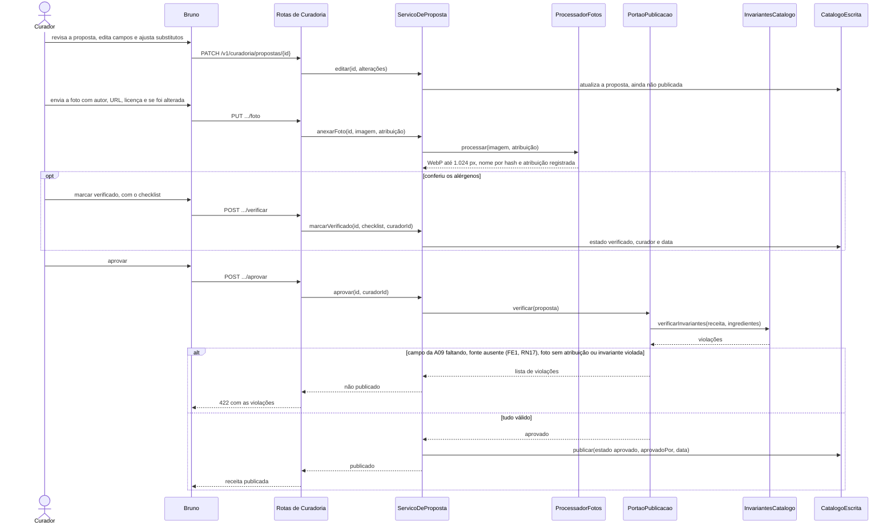

# Sequência — UC12, Importar e manter catálogo (fluxo assistido por IA)

> Fase 2.6 — Classes, sequências e contratos. Papel da IA: arquiteto, designer de componentes e de padrões (SOLID).
> Destino: `/docs/fase2/sequencia-uc12.md`. Versão 1.0 — 07/10/2026 — status: a revisar pela dupla.
> Rastreio: UC12 (FA2, FE1, FE2); RN15, RN17, RN21, RN22; RNF08, RNF11; US10, US18; A06, A09; ADR-007, ADR-010, ADR-011, ADR-012, ADR-013, ADR-014.
> Os participantes seguem os componentes do `c4-componentes.md` v1.1 e as classes do `diagrama-classes.md`.

## 1. Do texto à proposta

- **Nenhum dado de usuário** vai ao provedor. A entrada tem só o texto da receita, a fonte e a lista de ingredientes canônicos (RNF06, R11).
- O modelo nunca define estado de alérgeno nem fonte. O servidor atribui `nao_verificado` e preenche fonte e link com o que o curador informou.
- O controle de consumo checa o pior caso (`max_tokens`) antes da chamada. Aviso a 80% e bloqueio a 100% do teto. Os tokens são registrados mesmo quando a validação falha.
- O texto colado é conteúdo não confiável: instruções separadas do texto, agente sem ferramentas, saída validada por esquema, limite de 20.000 caracteres (hipótese) e campos tratados como texto simples (ADR-011, item 7).
- No FE2, a Fase 1 diz "notifica o curador e redireciona". Aqui vira resposta de erro com `fluxoManualDisponivel = true`, porque não há tela. Divergência para o Lote 3.
- A importação é síncrona. Se estourar o tempo limite no alvo, o ADR-004 prevê torná-la assíncrona.

## 2. Revisão, verificação e publicação

- Só o curador marca `verificado`. O checklist grava: ingredientes conferidos contra os 19 códigos, segunda fonte (recomendada), consistência entre receita e ingredientes, `semLactoseConferido` quando aplicável e `confirmadoSemAlergenos` quando a lista é vazia.
- O portão **bloqueia** por campo faltante da A09, fonte ausente (RN17), foto sem os quatro elementos de atribuição (ADR-012) ou invariante do ADR-014 violada (incluindo ingrediente com `leite` sem `lactose` e sem `semLactose`). A resposta lista as violações.
- Aprovar **não exige** `verificado`. Receita `nao_verificado` ou `declarado_fonte` pode ser publicada, mas não aparece nas sugestões de quem tem restrição (RN08). O lançamento exige 100 pratos verificados (A09).
- Verificar depois da publicação, ou editar receita publicada, atualiza a data dos alérgenos, e a mudança chega aos aparelhos pelo conjunto baixado (ADR-010, item 10; ADR-008, item 9).
- O fluxo manual usa as mesmas rotas, pulando a Parte 1: entra pela rota de receita manual, com o mesmo esquema e o mesmo portão (ADR-010, item 1).
